# 기초실험1: 저항, 전압, 전류 측정

## 실험목표
1. 칼라코드를 이용하여 저항값을 읽는 법을 익힌다. 멀티미터를 이용하여 저항값을 측정해본다.
2. 브레드보드의 내부구조를 파악하고 활용해본다.
3. 전원공급기를 이용하여 전압을 생성하고 회로에 공급한 뒤 전압을 측정해본다.
4. 회로의 특정 지점을 통해 흐르는 전류를 측정해본다.
-------------------------
이번 실험에 사용할 주요 부품과 이를 브레드보드에 구현한 주요 회로도는 다음과 같다.
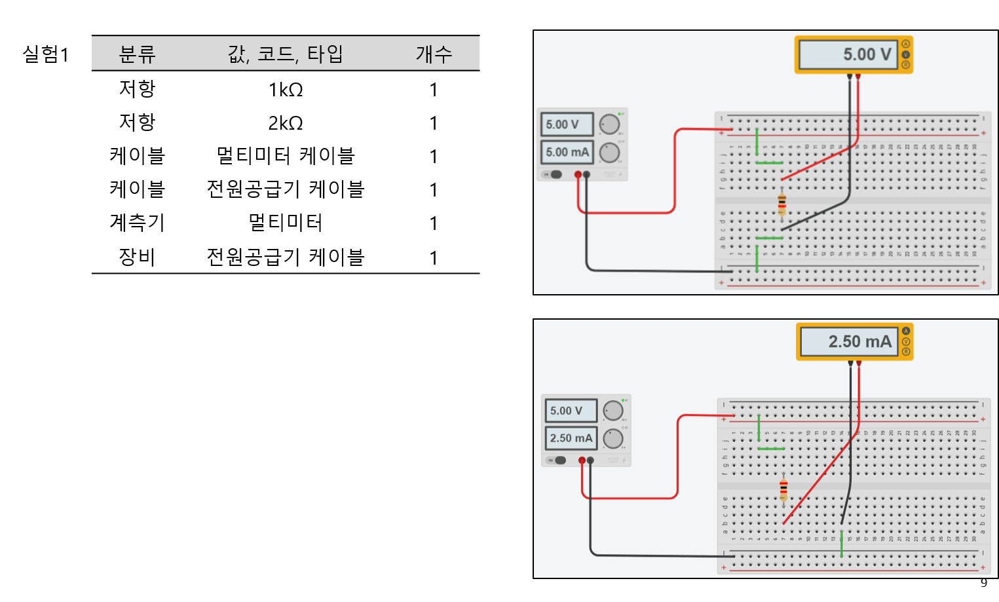

-------------------------
### 멀티미터 테스트

과전류 등으로 인해 멀티미터 내부 보호 퓨즈가 손상될 수 있으므로 먼저 멀티미터의 정상동작 여부를 Fuse Test를 통해 확인한다.

1. 멀티미터 전면부 다이얼을 조정하여 그림과 같이 스피커 모양의 위치로 다이얼을 조절하여 Fuse Test모드를 설정한다.
2. 멀티미터 케이블의 단자를 본체에 그림과 같이 연결한다. 색깔에 주의한다.
3. 멀티미터 케이블의 반대쪽 클립을 서로 연결한다.
4. 만약 멀티미티 내부 퓨즈가 끊어지지 않고 정상 동작할 경우 삑삑 소리가 나며 LCD화면에는 작은 저항값으로 표시된다. 만약 소리가 나지 않으면 퓨즈 교체를 하거나 전원을 확인해본다.

------------------
### 저항 칼라 코드 읽기

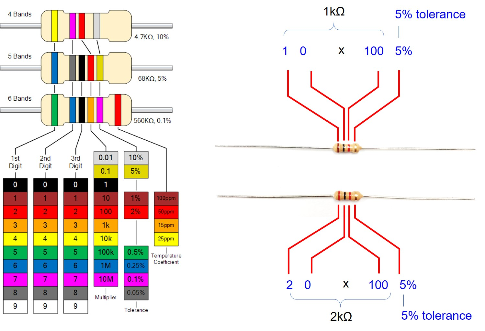

저항의 크기를 멀티미터를 이용하여 정확한 값을 측정할 수 있다. 그러나 저항에 표기된 칼라 띠를 이용하여 직접 저항값을 계산할 수 있다. 4색띠 표현된 저항의 경우 왼쪽 두개는 Digit를 표시하며 3번째는 지수곱, 그리고 마지막이 저항값의 오차를 나타낸다. 해당 색깔에 따라 계산에 사용되는 수치는 그림의 표를 참고한다.

예를 들어 오른쪽 위의 그림과 같은 저항의 경우, 첫번째 갈색은 1을 의미하고, 두번째는 검은색이므로 0을 의미한다. 두개를 합쳐서 10으로 표현된다. 3번째는 빨간색이므로 지수값으로 10의2승 혹은 100을 의미하고 이 값을 digit와 곱하므로 최종적으로 1000=1k를 나타낸다. 마지막 띠의 색깔이 금색이므로 5%오차를 가지는 저항을 의미한다. 띠가 왼쪽으로 몰려있지 않고 중간에 배치되어 오차 표시 부분이 어디인지 헷갈리는 경우, 보통 금색이나 은색띠가 오차에 해당되므로 반대쪽을 저항값 계산의 기준을 삼으면 된다. 

------------------
### 저항값을 멀티미터로 직접 측정해보기

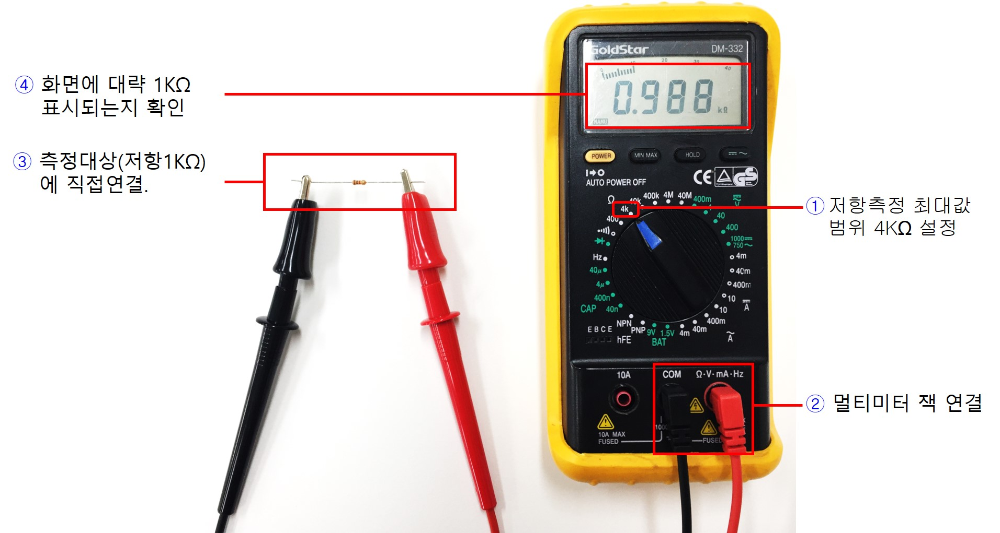

멀티미터를 이용하여 저항값을 직접 측정해보자.

1. 멀티미터 전면부 다이얼을 조정하여 저항측정모드로 설정한다. 이때 측정 저항값의 범위를 고려하여 해상도 범위를 적절히 설정한다. (그림은 최대 4KΩ 측정모드로 설정함)
2. 멀티미터 케이블의 연결 잭을 본체에 결합한다. 이때 색깔에 주의한다.
3. 멀티미터 케이블의 클립 사이에 저항을 연결한다.
4. 멀티미터 LCD 창에 현재 측정된 저항값이 표시된다. 1번에서 다이얼을 조절할 때 측정 대상의 범위를 고려하여 적절히 조정한다. 측정값이 현재 조절된 범위를 초과할 경우 소리가 나므로 더 큰 범위로 다이얼을 조절한다.

------------------
### 브레드보드 활용준비

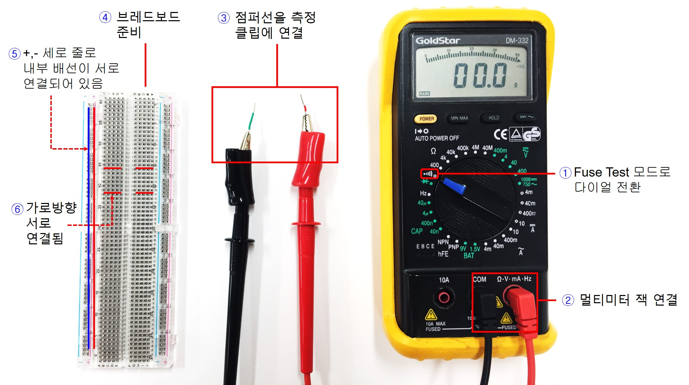

브레드보드를 이용하기 전 브레드보드의 내부 배선의 구조를 파악해보자.

1. 멀티미터 전면부 다이얼을 조정하여 스피커 모양의 Fuse Test모드로 이동시킨다.
2. 멀티미터 케이블의 연결 잭을 본체에 그림과 같이 결합한다. 이때 색깔에 주의한다.
3. 멀티미터 케이블의 반대쪽 클립에 적절한 크기의 점퍼선을 연결한다. (브레드보드의 원하는 위치에 삽입 하기 위함)
4. 그림과 같은 브레드보드를 먼저 준비한다. 표면에는 점들로만 구성되어 있으나 내부에는 서로 연결된 패턴이 존재한다. 멀티미터 Fuse Test를 이용하여 서로 연결 (Short) 되어 있는 구조를 파악해보도록 한다.
5. 그림에 표시된 라인을 따라서 (왼쪽,오른쪽 가장자리의 포트) 서로 연결되어 있다. 따라서 따로 점퍼선을 연결할 필요없이 내부적으로 배선이 연결되어 있음을 숙지하고 회로를 구성할 때 활용하도록 한다. 
6. 브레드보드의 가운데 영역은 그림에서 빨간색으로 표시한 선들과 같이 가로방향 패턴으로만 서로 연결되어 있다. 

------------------
### 브레드보드 내부배선의 연결구조 파악

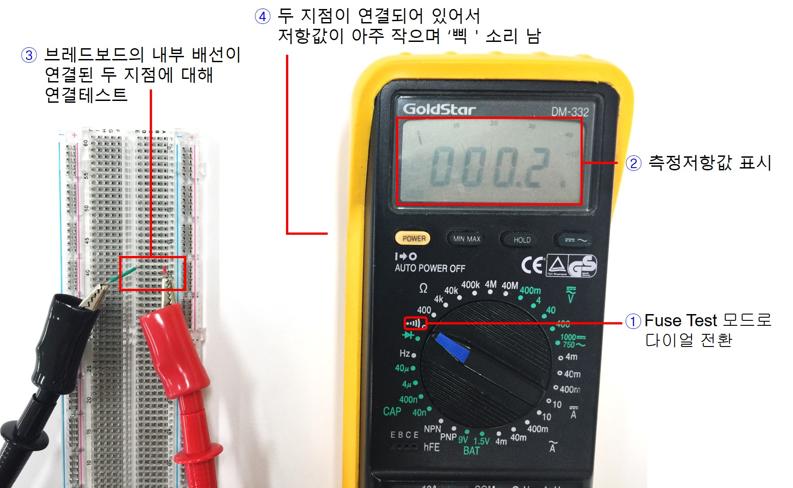

멀티미터의 Fuse Test모드를 활용하여 브레드보드 내부 배선 연결 구조를 파악해본다.

1. 멀티미터 전면부 다이얼을 조정하여 스피커 모양의 Fuse Test모드로 이동시킨다.
2. 멀티미터 LCD창에 현재 측정된 저항값이 표시된다.
3. 멀티미터 케이블 클립에 연결한 점퍼선을 브레드보드의 적절한 두곳에 연결하여 소리가 나는 지점을 확인하고 내부에 서로 연결되어 있는 위치를 파악한다. 
4. 그림에서 표시한 위치는 브레드보드 내부에서 서로 연결되어 있으므로 삑 소리가 나며 멀티미터 화면에도 작은 저항값이 표시된다.

------------------
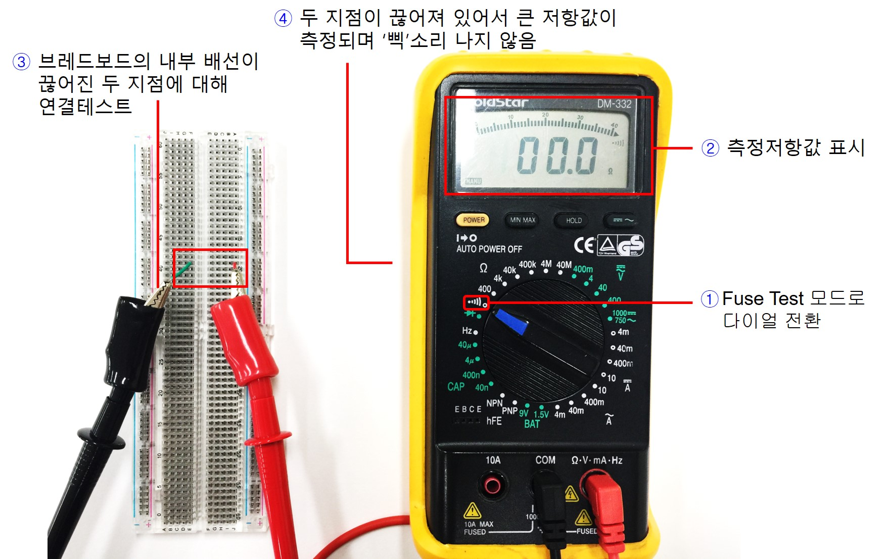

1. 멀티미터 전면부 다이얼을 조정하여 스피커 모양의 Fuse Test모드로 이동시킨다.
2. 멀티미터 LCD창에 현재 측정된 저항값이 표시된다.
3. 멀티미터 케이블 클립에 연결한 점퍼선을 브레드보드의 적절한 두곳에 연결하여 소리가 나지 않는 두 지점이 서로 끊어져 있음을 파악한다. 
4. 예상한대로 그림에 표시된 브레드보드의 두 지점은 서로 끊어져 있으므로 소리가 나지 않으며 큰 저항값이 측정된다.

------------------
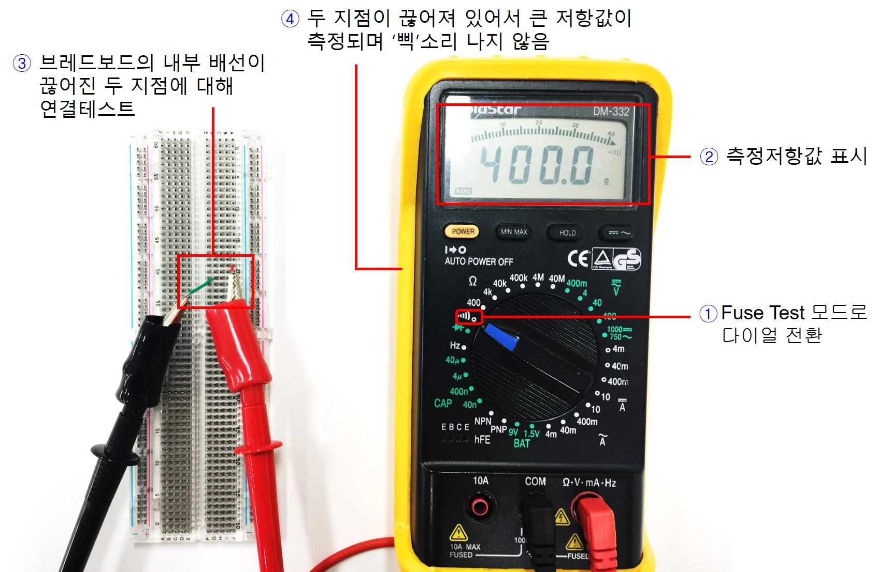

1. 멀티미터 전면부 다이얼을 조정하여 스피커 모양의 Fuse Test모드로 이동시킨다.
2. 멀티미터 LCD창에 현재 측정된 저항값이 표시된다.
3. 멀티미터 케이블 클립에 연결한 점퍼선을 브레드보드의 적절한 두곳에 연결하여 소리가 나지 않는 두 지점이 서로 끊어져 있음을 파악한다. 
4. 예상한대로 그림에 표시된 브레드보드의 두 지점은 서로 끊어져 있으므로 소리가 나지 않으며 큰 저항값이 측정된다.

------------------

1. 멀티미터 전면부 다이얼을 조정하여 스피커 모양의 Fuse Test모드로 이동시킨다.
2. 멀티미터 LCD창에 현재 측정된 저항값이 표시된다.
3. 멀티미터 케이블 클립에 연결한 점퍼선을 브레드보드의 적절한 두곳에 연결하여 소리가 나는 지점을 확인하고 내부에 서로 연결되어 있는 위치를 파악한다. 
4. 그림에서 표시한 위치는 브레드보드 내부에서 서로 연결되어 있으므로 삑 소리가 나며 멀티미터 화면에도 작은 저항값이 표시된다.

------------------
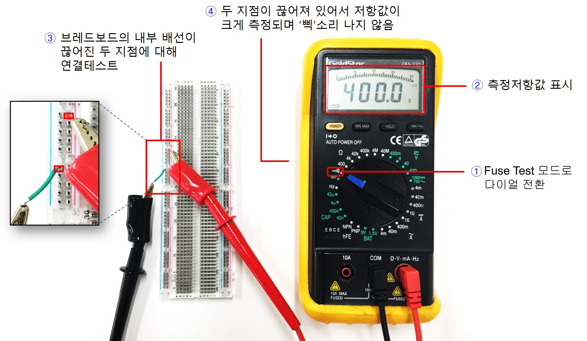

1. 멀티미터 전면부 다이얼을 조정하여 스피커 모양의 Fuse Test모드로 이동시킨다.
2. 멀티미터 LCD창에 현재 측정된 저항값이 표시된다.
3. 멀티미터 케이블 클립에 연결한 점퍼선을 브레드보드의 적절한 두곳에 연결하여 소리가 나지 않는 두 지점이 서로 끊어져 있음을 파악한다. 
4. 예상한대로 그림에 표시된 브레드보드의 두 지점은 서로 끊어져 있으므로 소리가 나지 않으며 큰 저항값이 측정된다.

------------------
### 브레드보드에 올바른 저항 배치 방법

브레드보드에 저항을 올바르게 배치하는 방법을 살펴보고 브레드보드에 배치된 회로의 저항값을 측정해보자

1. 멀티미터 전면부 다이얼을 조정하여 저항 측정 모드로 이동시킨다. 현재 1KΩ 저항을 연결하였으므로 측정범위를 4KΩ 위치로 설정하자.
2. 그림과 같이 브레드보드에서 서로 연결되어 있지 않는 두 지점에 저항을 배치한다.
3. 멀티미터 LCD창에 측정된 저항값을 살펴본다. 정상적으로 측정되어 대략 1KΩ이 표시됨을 알수 있다.

------------------
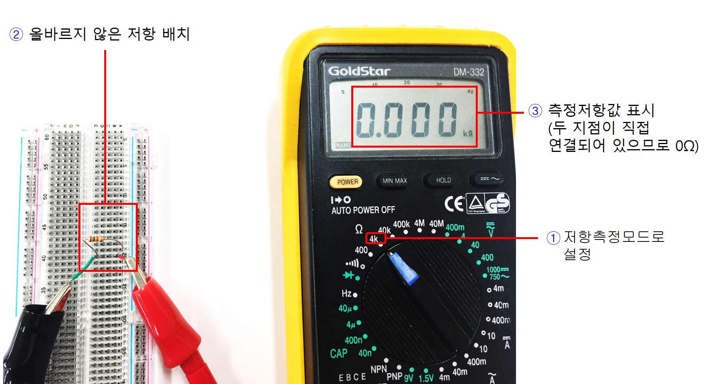

1. 멀티미터 전면부 다이얼을 조정하여 저항 측정 모드로 이동시킨다. 현재 1KΩ 저항을 연결하였으므로 측정범위를 4KΩ 위치로 설정하자.
2. 그림과 같이 브레드보드에서 서로 연결되어 있는 두 지점에 저항을 배치한다. 이 두 지점은 브레드보드 내부에서 직접 연결되어 있으므로 저항 크기가 0이다.
3. 멀티미터 LCD창에 측정된 저항값을 살펴본다. 배치된 저항값 1KΩ가 아닌 0에 가까운 값이 나온다. 따라서 잘못된 저항 배치 방법임을 알 수 있다.

------------------
### 브레드보드에 구성된 회로의 전압측정

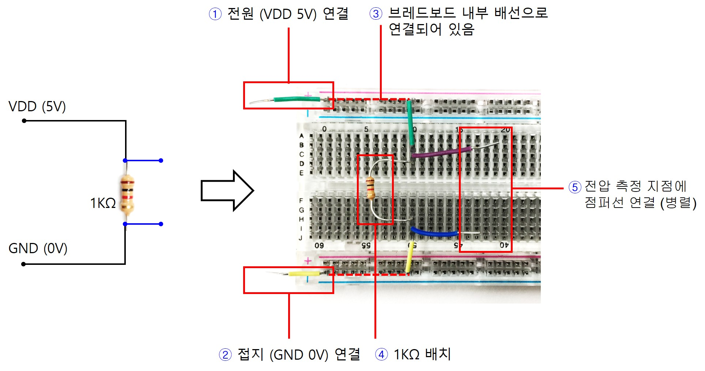

그림과 같이 브레드보드에 회로를 구성하고 동작 전압을 공급한 뒤 원하는 위치의 전압을 측정해보자. 전원공급기 사용법에 대해서는 장비 사용섹션을 참고하도록 한다.

1. 전원공급기에 출력 케이블을 연결하고 빨간색 클립을 브레드보드의 +로 표시된 가장자리에 연결한다. (출력 VDD전압(+)을 브레드보드에 공급)
2. 전원공급기에 출력 케이블을 연결하고 검은색 클립을 브레드보드의 -로 표시된 가장자리에 연결한다. (출력 GND전압(-)을 브레드보드에 공급)
3. 점선으로 표시된 라인은 이미 브레드보드의 내부에 연결되어 있으므로 별도의 점퍼선을 이용하여 연결할 필요가 없다.
4. 1KΩ을 그림과 같이 배치하고 VDD와 GND라인에 점퍼로 연결한다.
5. 저항에 인가되는 전압을 측정하기 위해 그림과 같이 점퍼선을 이용하여 전압 측정 지점을 따로 빼내도록 한다.

------------------
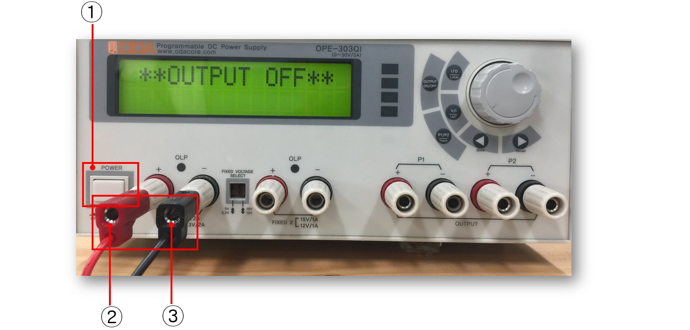

전원공급기의 고정전압 5V 출력 단자에 전원공급기 케이블을 연결하고 반대쪽 클립을 브레드보드의 회로에 연결해보자.

1. 그림에 표신된 전원 스위치를 눌러 전원을 켠다.
2. 고정전압 출력 포트에 빨간색 케이블 연결 (5V)
3. 고정전압 출력 포트에 검은색 케이블 연결 (GND)

------------------
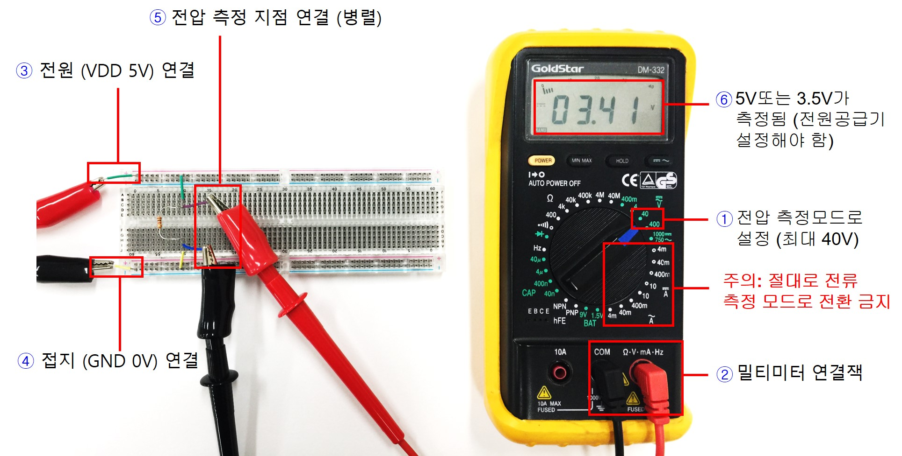

전원공급기 출력을 브레드보드의 회로에 연결하여 전압을 공급하고 회로의 특정지점의 전압을 측정해보자.

1. 멀티미터를 전압측정모드로 설정한다. 측정 전압을 예상하여 측정 범위가 적절하게 되도록 다이얼을 조절한다. 
2. 멀티미터 연결잭을 본체에 결합하고 케이블 반대쪽 측정클립을 측정대상에 연결하도록 준비한다.
3. 전원공급기의 출력 VDD전압(+)을 브레드보드의 + 지점에 연결된 점퍼선에 그림과 같이 연결한다.
4. 전원공급기의 출력 GND전압(-)을 브레브보드의 - 지점에 연결된 점퍼선에 그림과 같이 연결한다.
5. 전압 측정 지점에 그림과 같이 멀티미터 측정 클립을 병렬로 연결한다.
6. 대략 5V또는 3.5V가 측정될 것이다. (5V 또는 3.3V 여부는 전원공급기 출력포트 옆 스위치를 이용하여 조절가능. 전원공급기 설명섹션을 참고)

------------------
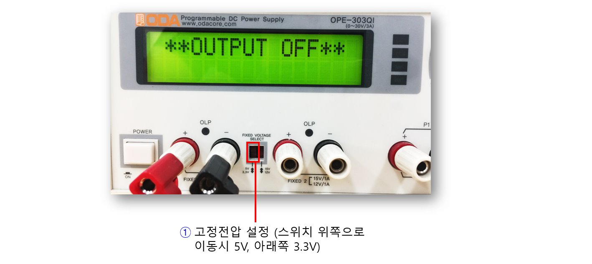

전원공급기의 고정전압 출력포트에서 생성되는 출력 전압값 5V,또는 3.3V 여부를 스위치로 선택할 수 있다. 

1. 전원공급기 하단에 그림에 표시된 위치는 고정전압 출력 포트이며 2개 존재한다. 왼쪽 포트에서 생성되는 출력 전압을 조절하기 위해서 그림에 표시된 부분의 스위치를 볼펜 등의 팁을 이용하여 위쪽 위치로 이동시킨다. 위로 이동시 5V가 출력되며 아래로 스위치를 내리면 출력으로 3.3V가 생성된다.

------------------
### 브레드보드에 구성된 회로의 전류측정

그림과 같이 회로에 전압을 공급할 수 있고 전류를 측정할 수 있는 형태의 회로를 브레드보드에 구성해보자.

1. 전원공급기의 출력단자에 케이블을 연결하고 반대쪽 빨간색 라인의 클립을 브레드보드의 +에 연결한다.
2. 전원공급기의 출력단자에 케이블을 연결하고 반대쪽 검은색 라인의 클립을 브레드보드의 -에 연결한다.
3. 점선으로 표시된 라인은 이미 브레드보드의 내부에 서로 연결되어 있으므로 별도의 점퍼를 사용하여 연장할 필요가 없다.
4. 2KΩ을 그림과 같이 배치하고 위쪽 VDD라인과 아래쪽 GND라인에 그림과 같이 점퍼를 이용하여 서로 연결한다.
5. 저항을 통해 흐르는 전류를 측정하기 위해 그림과 같이 2개의 점퍼선으로 따로 빼내어 직렬로 멀티미터에 연결할 수 있도록 준비한다.

------------------
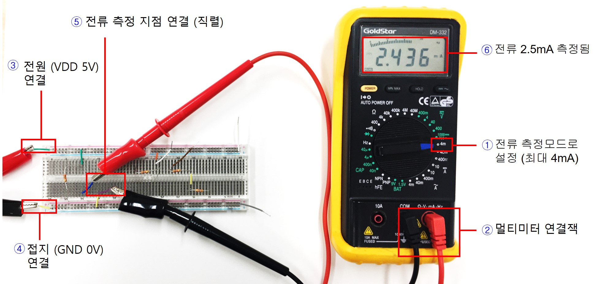

전원공급기 출력을 브레드보드에 구성된 회로에 연결하여 전압을 공급하고 회로의 특정 지점을 통해 흐르는 전류를 측정해보자.

1. 먼저 멀티미터를 전류 측정모드 설정한다. 아직 멀티미터 측정 팁을 회로에 연결하지 않는다. 측정 전류범위를 적절하게 설정한다. 
2. 멀티미터 케이블 단자를 본체의 입력포트에 결합한다. 멀티미터 측정 클립을 대상회로에 연결하기 전에 반드시 회로에 직렬로 연결하는지 한번 더 살펴본다. 멀티미터를 전류측정모드로 설정할 경우 본체의 내부저항이 0이 되므로 멀티미터를 저항 양단과 같이 2개의 지점에 병렬로 연결하게 되면 멀티미터 본체 내부로 과전류가 흘러들어오게 되며 휴즈가 끊어질 수 있다.
3. 전원공급기의 출력포트에 케이블을 연결하고 반대쪽 빨간색 선의 클립을 그림에 표시된 브레드보드의 + 지점에 연결한다.
4. 전원공급기의 출력포트에 케이블을 연결하고 반대쪽 검은색 선의 클립을 그림에 표시된 브레드보드의 - 지점에 연결한다.
5. 전류 측정 지점을 2개의 점퍼선으로 뽑아낸 곳에 그림과 같이 멀티미터 측정 클립을 직렬로 연결한다. (기존 회로와 멀티미터가 직렬로 연결되어 있는지 연결구성을 반드시 확인한다.)
6. 멀티미터 측정화면에 약 2.5mA가 측정되는지 확인한다.

