# 기초실험2: Ohm's Law (전압,전류,저항 관계 이해)

본 실험을 통해 전압, 전류, 저항의 관계를 실험적으로 파악해보자. 

실험목표는 아래와 같다.
1. (R=V/I): 저항을 고정한 뒤 전압 변화에 따른 전류 관계를 실험으로 관찰한다. 
2. (I=V/R): 전압을 고정한 뒤 가변저항을 이용하여 저항 변화에 따른 전류 제한 현상을 관찰한다.
3. (V=IxR): 저항값과 전류량에 비례하여 저항 양단의 전압강하가 커지는 현상을 관찰한다.

## Power Supply (전원공급기)의 가변전압 출력을 조절

### 가변전압 출력 On/Off

전원공급기의 가변전압을 생성하고 출력포트에 케이블을 연결해본다. 그림과 같이 가변출력 포트 2채널에 케이블을 연결하여 회로에 전압을 공급할 수 있다.

1. 그림의 표시된 위치는 P1출력 포트이며 +/- 단자로 구분되어 있으므로 색깔에 맞추어 전원공급기 케이블 단자를 연결한다.
2. 그림의 표시된 위치는 P2출력 포트이며 +/- 단자로 구분되어 있으므로 색깔에 맞추어 전원공급기 케이블 단자를 연결한다.
3. 다이얼 왼쪽에 위치한 가변전압 출력 On/Off 버튼을 눌러 출력 전압을 생성한다. (On되면 LCD창에 채널별 전압/전류 표시됨)
4. 화면에 출력 채널 P1, P2가 구분되어 표시된다.
5. 현재 채널별 출력 전압/전류가 표시된다. 다이얼을 돌려 전압, 전류를 조절할 수 있다. 

----------------------------------
### 가변전압 출력 포트에 케이블 연결

가변전압 출력포트에 케이블을 연결해본다.

1. P1채널의 +단자에 빨간색 케이블을 연결하고 -단자에 검은색 케이블을 연결한다. 반대편 클립을 회로에 연결하여 전압을 공급할 수 있다.

----------------------------------
### 가변전압 값 조절해보기 (P1 채널)

P1채널의 가변 출력 전압의 크기를 다이얼로 조절해보자. 실시간으로 조절되는 전압, 전류가 LCD화면에 표시되므로 값을 확인하면서 조절하도록 한다.

1. 먼저 출력 전압을 조절하기 전에 채널선택을 위한 P1/P2 버튼을 눌러서 커서가 원하는 채널 (현재 P1)으로 이동시킨다.
2. 현재 커서가 P1에 위치에 있는지 확인한다. P2에 있다면 1번 항목의 버튼을 한번 더 누른다. 커서가 전류쪽에 있다면 V/I 버튼을 눌러서 전압 위치로 커서를 이동시킨다.
3. 다이얼을 돌려 원하는 만큼의 전압을 설정한다. (5V)
4. 현재 출력 전압값이 표시된다.

----------------------------------
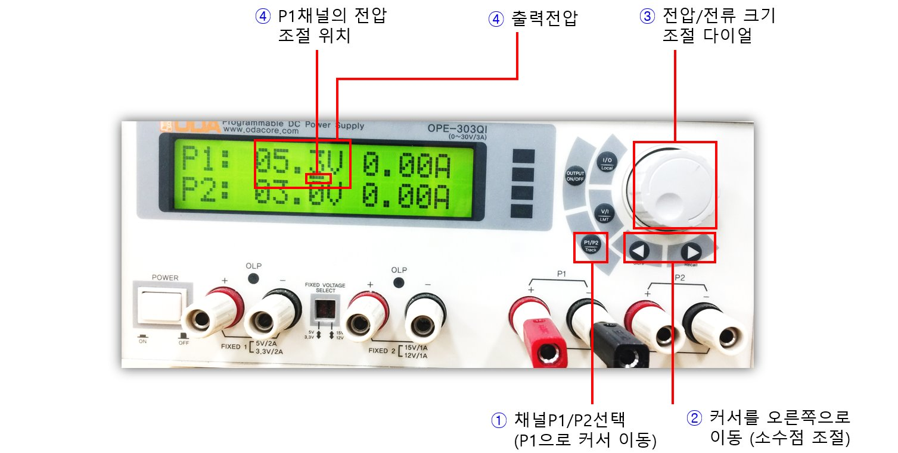

P1채널의 가변출력전압의 소수점 이하값을 다이얼로 조절해본다.

1. 채널선택 P1/P2 버튼을 눌러서 원하는 채널 (현재 P1)로 커서를 이동시킨다.
2. 현재 커서가 P1에 위치에 있는지 확인한다. P2에 있다면 1번 항목의 버튼을 한번 더 누른다. 커서가 전류쪽에 있다면 V/I 버튼을 눌러서 전압 위치로 이동시킨다. 이후에 그림에 표시된 화살표 버튼을 이용하여 원하는 소수점 위치로 커서를 이동시킨다.
3. 다이얼을 돌려 원하는 만큼의 전압을 설정한다 (5.3V)
4. 값을 조절할 수 있는 현재 위치가 그림과 같이 커서로 표시된다.
5. 현재 출력 전압값이 표시된다.

## 세부실험 2-1: (R=V/I): 전압 변화에 따라 저항을 통해 흐르는 전류

본 실험에서는 저항값을 고정하고 공급전압을 가변시키면서 저항을 통해 흐르는 전류의 변화를 측정하여. V/I값이 일정함을 실험으로 확인한다. 

### 브레드보드에 회로 구성

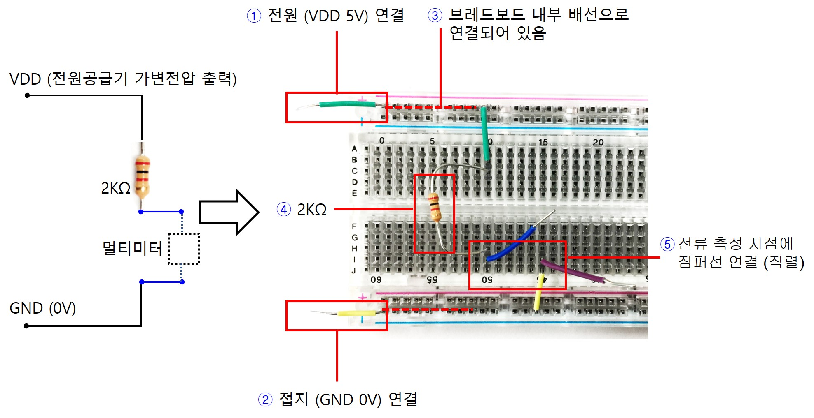

저항을 그림과 같이 브레드보드에 배치한 뒤 전류측정 지점을 점퍼선 2개로 분리하여 멀티미터에 직렬로 연결한 뒤 전류를 측정한다.

1. 전원공급기의 가변전압 출력에 케이블을 연결하고 반대쪽 빨간색 선 클립을 그림에 표시된 브레드보드의 +에 연결한다. 
2. 전원공급기의 가변전압 출력에 케이블을 연결하고 반대쪽 검은색 선 클립을 그림에 표시된 브레드보드의 -에 연결한다.
3. 그림에 표시된 선은 브레드보드의 내부에 서로 연결되어 있으므로 별도의 점퍼선으로 연결할 필요가 없음에 주의하자.
4. 그림과 같이 브레드보드에 저항을 배치한다. 
5. 그림과 같이 전류를 측정하고자 하는 지점을 점퍼선 2개로 분리하여 뽑아둔다. 멀티미터 케이블을 이 두지점에 직렬로 연결한다.

### 멀티미터를 이용한 전류 측정

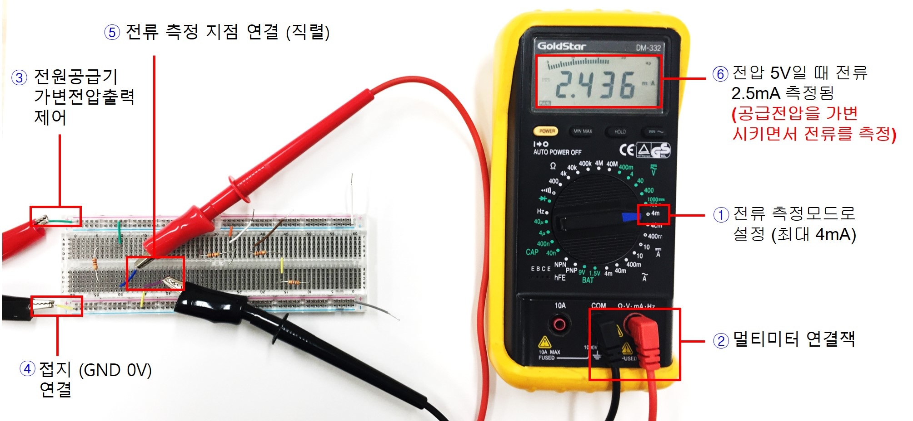

1. 멀티미터를 전류 측정모드로 설정한다. 측정 전류의 범위를 고려하여 적절한 위치로 조절한다.
2. 멀티미터 연결잭을 본체에 결합한다.
3. 전원공급기 출력 포트에 케이블을 연결하고 반대쪽 클립을 그림과 같이 브레드보드의 전원, 접지에 연결한다. 
4. 점퍼선으로 분리해둔 전류 측정지점에 멀티미터 측정 클립을 직렬로 연결한다. 멀티미터 케이블을 회로에 연결하기전에 반드시 직렬로 연결하는지 확인한다.
5. 전원공급기의 가번전압 출력 크기를 다이얼을 이용하여 조정하면서 회로를 통해 흐르는 전류를 멀티미터를 이용ㅎ여 측정하고 이를 V-I 그래프로 표시해본다. 가로축으로 전압(V), 세로축으로 전류(I)의 그래프로 표시해보았을때 기울기 값과 현재 회로에 사용한 저항크기와의 관계를 생각해본다.

## 세부실험 2-2: (I=V/R): 저항 변화에 따른 전류 제한 특성

본 실험에서는 전원 전압을 고정한 뒤 저항 크기를 가변시키면서 전류크기의 변화를 관찰하여 저항이 전류를 제한하는 특징을 가짐을 이해한다. 

### 가변저항 

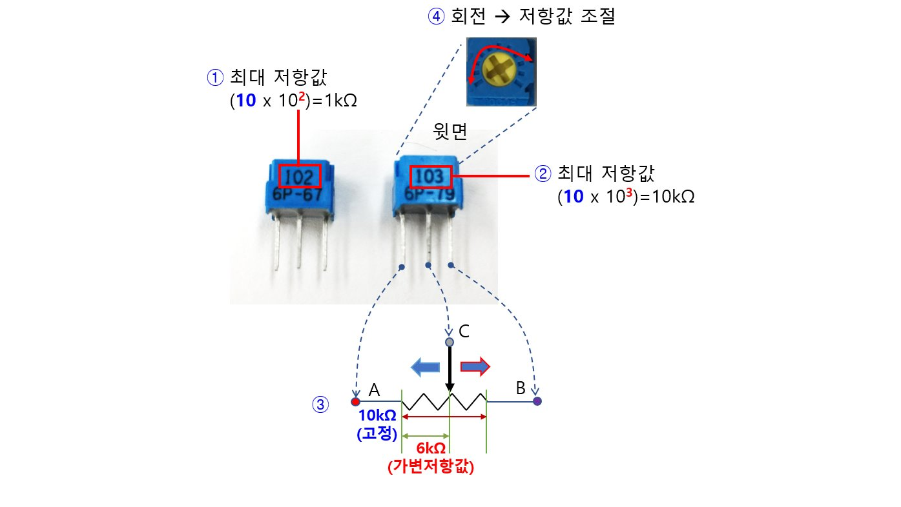

가변저항 값 읽는 방법과 저항 연결방법에 대해 살펴보고 가변 저항값을 적절히 조절해보자.

1. 가변저항 측면부에 그림과 같이 코드값이 표기되어 있다. 첫번째 두자리는 digit이며 세번째는 지수값을 나타낸다. 예를 들어 그림과 같이 102로 되어 있을 경우 1kΩ을 의미하며 이 값은 가변저항의 상단 다이얼을 회전하였을때 최대 저항치를 나타낸다.
2. 같은 원리로 가변저항 측면에 103으로 표기되어 있을 경우 가변저항의 최대값이 10kΩ임을 나타낸다.
3. 가변저항은 그림과 같이 3개의 터미널 포트로 구성되어 있으며 그림과 같이 내부에 서로 연결되어 있다. 따라서 A-B 포트 사이는 항상 저항의 최대값이 측정되며, A-C또는 C-B사이에 현재 조절된 가변 저항 값이 측정된다.
4. 가변저항의 상단에 십자로 표신된 부분을 드라이버 등으로 돌려서 A-C 또는 C-B 사이의 저항크기를 가변시킬 수 있다. A-C, C-B 사이의 가변저항의 최대값은 A-B사이에 측정되는 값과 같으며 그 값은 1번,2번에서 서술한 것과 같이 측면부 코드값을 이용하여 계산할 수 있다.  

### 가변저항을 브레드보드에 배치

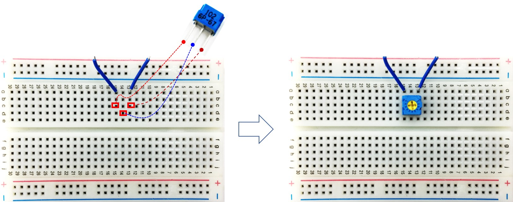

1. 가변저항을 브레드보드의 빨간색으로 표시된 3지점에 연결한다. 
2. 현재 조절된 가변 저항 크기를 측정할 수 있도록 A, B 포트를 점퍼로 뽑아 둔다.
3. 가변저항을 장착한 모습은 그림과 같다. 

### 가변저항의 저항값 측정

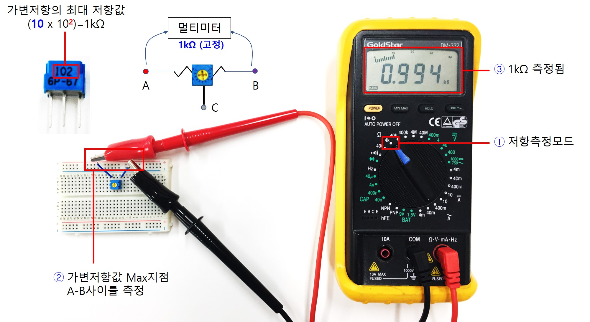

1. 멀티미터를 저항측정모드로 설정한다. 
2. 가변저항의 A,B 포트에 멀티미터 측정클립을 그림과 같이 연결한다. 
3. 현재 사용된 가변저항이 102로 표시되어 있으므로 최대 1kΩ를 의미한다. 따라서 가변저항의 A-B 포트 사이의 저항을 멀티미터로 측정하면 1kΩ가 되어야 한다.

--------------------
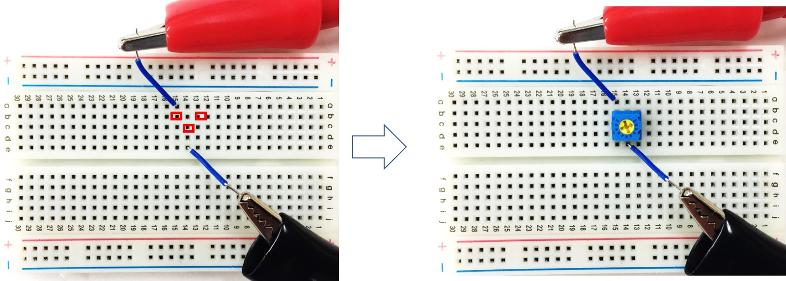

1. 그림과 같이 가변저항을 브레드보드의 빨간색으로 표시된 3지점에 연결한다. 
2. 가변저항값을 측정할 수 있도록 A, C 포트를 점퍼로 뽑아둔다.
3. 가변저항을 장착한 모습은 그림과 같다. 

--------------------

1. 멀티미터를 저항측정모드로 설정한다. 
2. 가변저항의 A,C 포트에 멀티미터 케이블의 클립을 연결한다. 
3. 드라이버 등으로 나사를 회전시키면서 저항값을 조절해본다.
4. 현재 사용한 가번저항은 최대 1kΩ이므로 볼트를 회전시키면 1kΩ보다 작은 저항값이 측정되어야 한다.

### 저항의 크기에 따른 전류 변화 측정 (전류 제한특성 관찰)

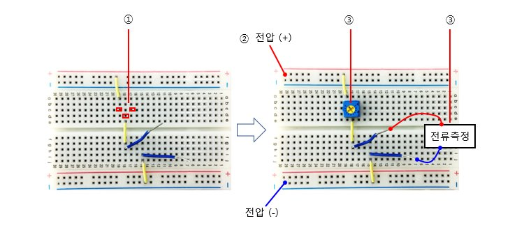

1. 브레드보드에 그림과 같이 점퍼선을 이용하여 회로를 구성해본다. 빨간색 지점에는 가변저항을 연결한다.
2. 전원공급기 출력 케이블의 클립을 연결할 수 있도록 그림과 같이 점퍼선을 연결해둔다.
3. 가변저항을 그림과 같이 배치한다.
4. 멀티미터를 이용하여 전류를 측정하기 위해 그림과 같이 점퍼선으로 측정지점을 뽑아둔다.

----------------------
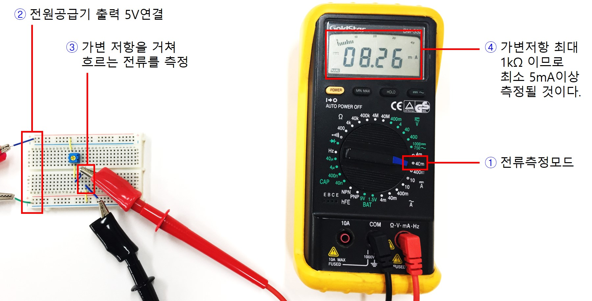

1. 멀티미터를 전류측정 모드로 전환한다.
2. 전원공급기 출력을 5V로 설정하고 케이블을 이용하여 브레드보드에 구성된 회로에 그림과 같이 연결한다.
3. 가변저항으로 흐르는 전류를 측정하기 위해 그림페 표시된 위치에 직렬로 멀티미터를 연결한다.
4. 현재 사용한 가변저항의 최대값이 1kΩ이므로 최소 5mA 전류가 측정될 것이다. 가변저항 값을 조절하면 1kΩ보다 작은 저항으로 설정되므로 5mA보다 더 큰 전류가 측정될 것이다.

## 세부실험 2-3: (V=IR): 저항크기와 전압 강하의 관계를 이해 

본 실험을 통해 저항이 커질수록 저항양단의 전압이 커지는 현상을 관찰해보자.

### 회로 구성

그림과 같이 저항 1개와 가변저항 1개를 직렬로 연결하고 가변저항의 크기에 따른 전압강하를 측정할 수 있도록 브레드보드에 회로를 구성해보자.

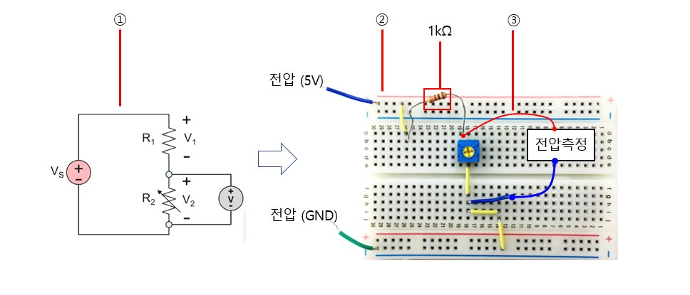

1. 저항1kΩ과 가변저항을 그림과 같이 직렬로 연결한 뒤 전원공급기의 출력을 연결한다.
2. 이에 대응되는 회로를 브레드보드에 구성해본다.
3. 가변저항 양단 전압을 멀티미터로 측정할 수 있도록 그림과 같이 점퍼선을 연결해둔다.

### 저항 크기를 조절하며 전압측정

가변저항의 크기를 조절하여 저항값이 커질 수록 더 전압이 크게 걸리는 현상을 관찰해보자. 가변저항 양단 전압이 커지는 만큼 고정 저항 1kΩ 양단의 전압이 작아지는 것도 관찰한다. 저항 각각에 인가되는 전압의 합은 전원공급기로부터 공급되는 전압과 같음을 확인한다.

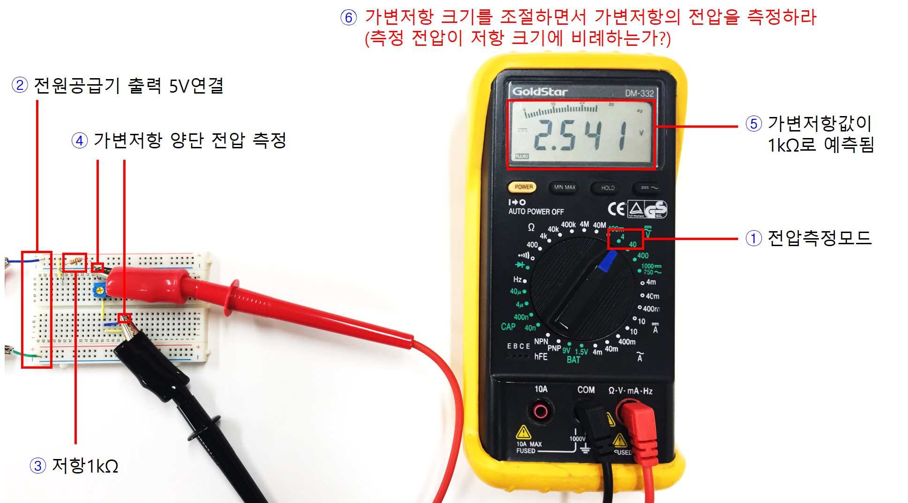

1. 멀티미터를 전압측정모드로 설정한다.
2. 전원공급기의 출력 5V를 브레드보드에 공급한다.
3. 전원이 회로에 공급되면 저항 1kΩ과 가변저항을 통해 전류가 흐르기 시작하며 이에 따라 각 저항에 전압 강하가 발생한다. V=IR식을 통해 저항크기에 비례하여 전압 강하가 일어날 것으로 예상해본다.
4. 가변저항 양단에 병렬로 멀티미터를 연결하여 전압강하를 측정해보자.
5. 가변저항의 상단 나사를 드라이버 등으로 조절하여 전압이 변하는 것을 관찰해보자. 2.5V 정도가 관찰되는 지점에서 가변저항 조절을 멈춘다.
6. 가변저항의 크기가 클수록 전압이 커지는가? 가변저항에 더 많은 전압이 인가될 수록 1kΩ 고정저항에 걸리는 전압이 작아지는지 측정해보자. 각 저항에 인가되는 전압의 합은 어떻게 되는지 측정해본다.

