# 기초실험3: 직렬회로, 병렬회로

본 실험에서는 먼저 직렬저항회로에서 전압분배 현상을 실험으로 이해한다. 두번째로 병렬저항회로에서 전류분배원리를 실험을 통해 이해힌다.

## 실험목표
1. 직렬저항회로를 구성해보고 전체 저항값을 측정해본다. 개별 저항과 전체 저항의 관계를 파악한다.
2. 직렬저항회로에서 개별저항 양단에 걸리는 전압을 측정해본다. 회로에 공급되는 전압이 직렬로 연결된 저항 각각에 분배되는 현상을 관찰한다.
3. 직렬저항회로 전체로 흐르는 전류를 측정해보고 등가저항으로 교체한 뒤에 흐르는 전류가 동일함을 실험을 통해 관찰한다.
4. 병렬저항회로의 전체저항을 멀티미터로 측정해보고 병렬회로 등가저항 계산식과 일치하는지 실험으로 비교해본다.
5. 병렬회로에서 각 저항으로 흐르는 전류를 측정해보고 저항 크기에 따른 전류 분배 원리를 실험으로 이해한다. 
-------------------------
이번 실험에 사용할 주요 부품과 이를 브레드보드에 구현한 주요 회로도는 다음과 같다.
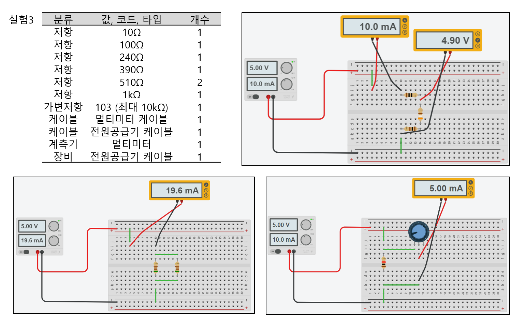

--------------------------
### 예비보고서

1. 본 실험 자료를 읽고 실험 목차, 절차, 예상 결과에 대해 요약해본다. 
2. 추가로 담당교수의 지시사항을 숙지하여 사전조사한 내용을 예비 리포트에 작성해 온다.

---------------------------
### 결과보고서

1. 담당교수의 지시사항을 숙지하여 해당 내용에 대한 실험을 실시하여 실험과정, 측정데이타를 결과 보고서에 작성하여 제출한다.
2. 본 실험자료에서 제시된 기본적인 실험 과정, 장비사용방법, 측정 결과들을 충실히 요약 정리한다. 
3. 실험과 관련된 이론과 실측치를 비교하여 회로의 전기적 동작 원리에 대한 결론을 내려본다. (Optional) 
4. 2개의 A,B 저항으로 구성된 직렬저항회로에서 저항 B가 더 커지면 전체 전류가 작아진다. 그럼에도 불구하고 저항 B에 인가되는 전압(V=IR)이 더 커지는 이유에 대해서 수식으로 생각해보고 이유에 대해 작성한다. 저항크기 증가에 비해 전류 감소폭이 더 작은가? (Optional)

------------------------
## 세부실험 3-1: 직렬저항회로를 구성하고 전체 저항값을 측정

본 실험에서는 저항 3개로 구성된 직렬저항회로를 구성해본 뒤 직렬저항 3개 전체에 대한 저항값을 멀티미터로 측정해보고 계산식과 일치하는지 비교해본다.

### 브레드보드에 직렬저항회로 구성

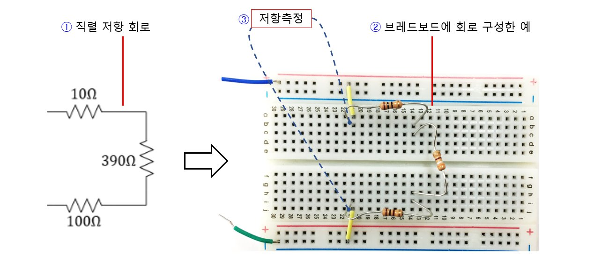

1. 그림은 저항 3개를 직렬로 연결한 회로이다.
2. 이를 브레드보드에 구성한 예를 보여준다.
3. 멀티미터를 저항측정모드로 설정한 뒤 그림과 같이 멀티미터 측정 클립을 저항 3개의 양단에 연결하여 전체 저항값을 측정해보자. 직렬저항회로의 등가저항을 계산한 결과와 비교해본다.

--------------------------
## 세부실험 3-2: 직렬저항회로에서 전압분배법칙 관찰

직렬저항으로 구성된 회로에 대해 각 저항에 인가되는 전압을 측정해보고 직렬회로에서 전압분배법칙을 실험으로 이해한다.

### 직렬저항회로에서 각 저항에 인가되는 전압 측정

1. 멀티미티를 전압측정모드로 전환한다.
2. 멀티미터 측정 케이블을 그림과 같이 연결한다.
3. 전원공급기의 출력을 5V로 설정하고 브레드보드에 공급한다.
4. 그림에 표시된 지점에 멀티미터 측정 클립을 연결하여 직렬로 연결된 저항 3개 양단에 인가되는 전압을 측정한다.
5. 멀티미터 화면에 현재 측정된 전압이 표시된다. 전원공급기 출력이 그대로 저항3개 전체에 인가됨을 확인한다.

---------------------
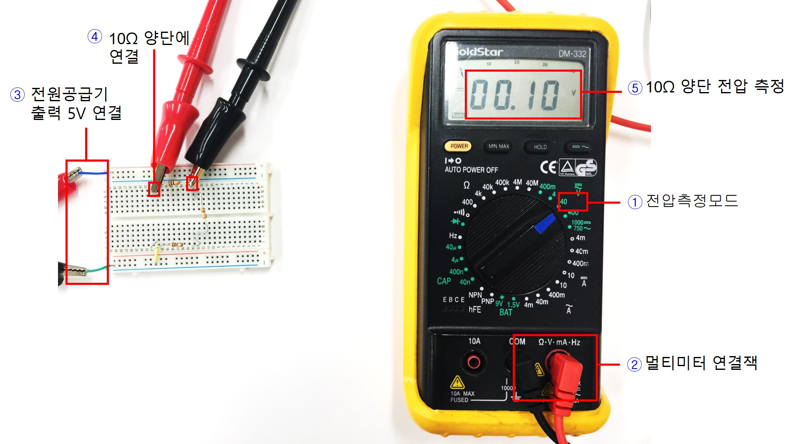

1. 멀티미터를 전압측정모드로 전환한다.
2. 멀티미터 측정 케이블을 연결한다.
3. 전원공급기의 출력을 5V로 설정하고 브레드보드에 공급한다.
4. 그림에 표시된 지점에 멀티미터 측정 클립을 연결하여 첫번째 저항 10Ω에 인가되는 전압을 측정한다.
5. 측정된 전압이 표시된다. 저항 크기와 전압강하의 관계에 대해 생각해본다.

---------------------

1. 멀티미터를 전압측정모드로 전환한다.
2. 멀티미터 측정 케이블을 연결한다.
3. 전원공급기의 출력을 5V로 설정하고 브레드보드에 공급한다.
4. 그림에 표시된 지점에 멀티미터 측정 클립을 연결하여 두번째 저항 390Ω에 인가되는 전압을 측정한다.
5. 측정된 전압이 표시된다. 저항 크기와 전압강하의 관계에 대해 생각해본다.

---------------------
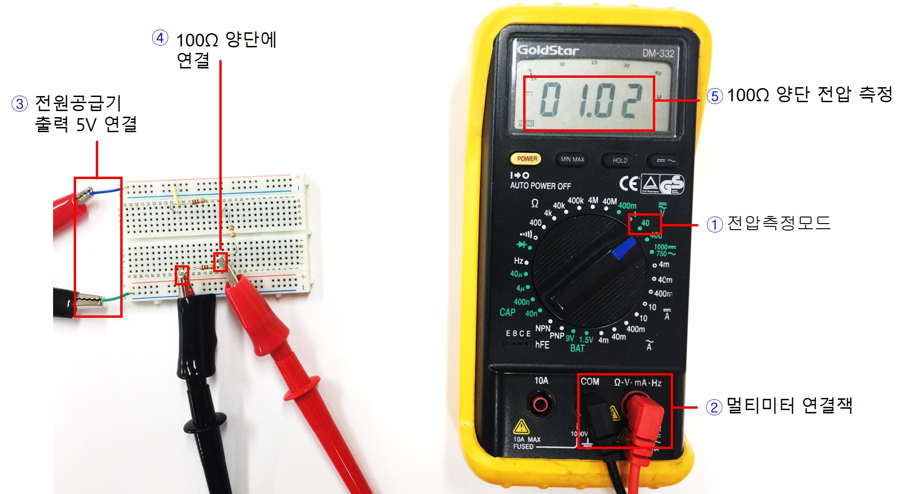

1. 멀티미터를 전압측정모드로 전환한다.
2. 멀티미터 측정 케이블을 연결한다.
3. 전원공급기의 출력을 5V로 설정하고 브레드보드에 공급한다.
4. 그림에 표시된 지점에 멀티미터 측정 팁을 연결하여 세번째 저항 100Ω에 인가되는 전압을 측정한다.
5. 측정된 전압이 표시된다. 저항 크기와 전압강하의 관계에 대해 생각해본다.

-------------------------
### 직렬저항회로에서 저항 2개에 인가되는 전압 측정

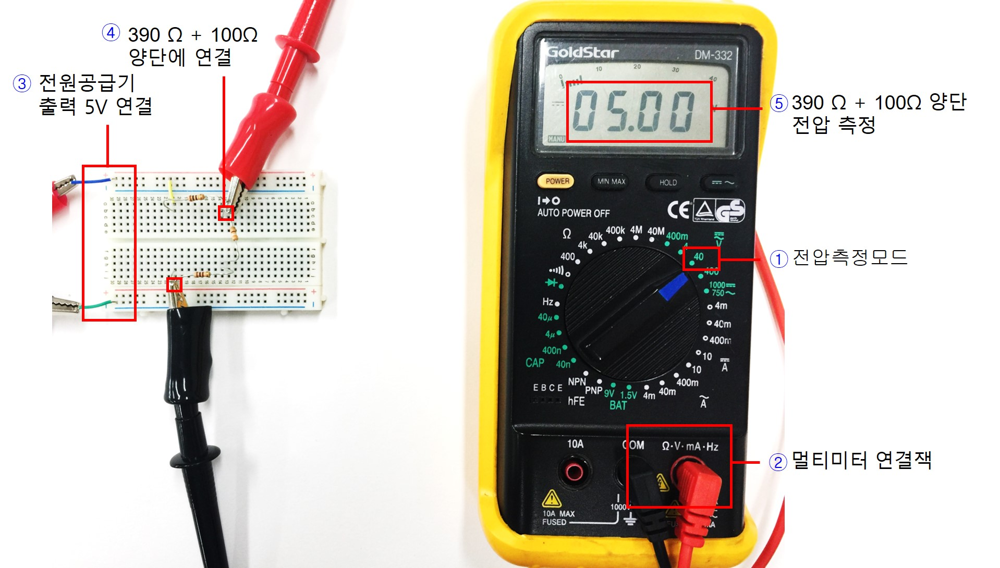

1. 멀티미터를 전압측정모드로 전환한다.
2. 멀티미터 측정 케이블을 연결한다.
3. 전원공급기의 출력을 5V로 설정하고 브레드보드에 공급한다.
4. 그림에 표시된 지점에 멀티미터 측정 클립을 연결하여 두번째 세번째 저항 390Ω + 100Ω에 인가되는 전압을 측정한다.
5. 측정된 전압이 표시된다. 저항 각각에 걸리는 전압의 합과 저항 2개에 대해 측정한 전압을 비교해본다.

-------------------------------
## 세부실험 3-3: 직렬저항을 등가저항으로 교체 후 특성 비교

직렬저항 3개로 구성된 회로로 흐르는 전류를 측정해보고, 직렬저항 3개를 등가저항 1개로 교체한 뒤 그 저항으로 흐르는 전류를 서로 비교해본다. 두 회로는 동작 전압, 전류 측면에서 동일한 특성을 가진다고 볼수 있는지 생각해본다.

-------------------------
### 직렬저항회로의 동작전류 측정

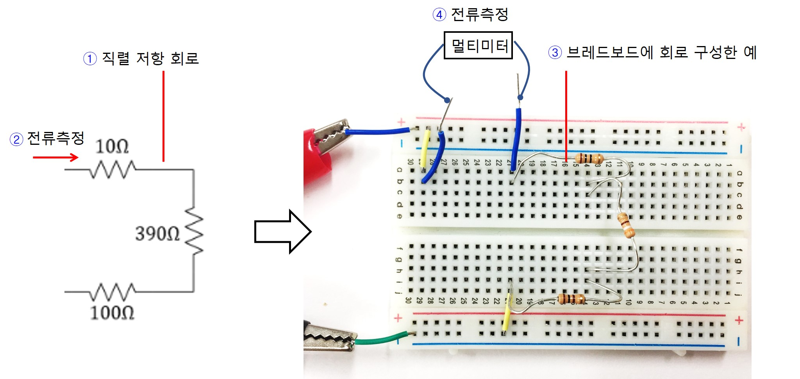

1. 그림과 같은 저항 3개가 직렬로 연결된 회로를 가정한다.
2. 이 회로에서 저항을 통해 흐르는 전류를 측정해보자.
3. 이를 위해 브레드보드 상에 회로를 구성한 예는 그림과 같다. 
4. 저항을 통해 흐르는 전류를 측정하기 위해 전류 측정지점을 2개의 점퍼선으로 분리하여 뽑아둔다. 향후 여기에 멀티미터를 직렬로 연결한다.

--------------------
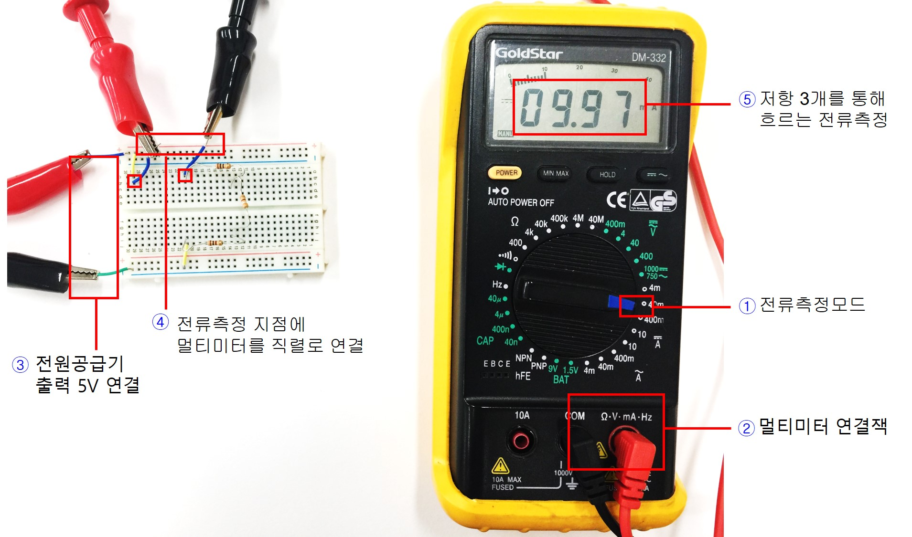

1. 멀티미터를 전류측정모드로 전환한다.
2. 멀티미터 측정 케이블을 연결한다.
3. 전원공급기 출력 5V를 회로에 공급한다.
4. 전류측정 지점에 뽑아둔 점퍼선 2곳에 그림과 같이 멀티미터 측정 클립을 직렬로 연결한다.
5. 측정되는 전류값을 관찰한다. 입력전압 크기를 저항3개의합으로 나눈 값과 비교해본다. 

-----------------------------
### 직렬저항의 합으로 교체한 뒤 동작전류 비교

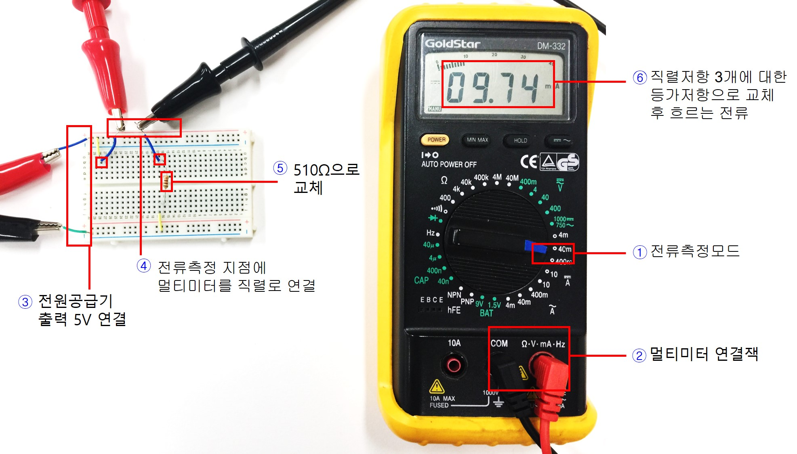

1. 멀티미터를 전류측정모드로 전환한다.
2. 멀티미터 측정 케이블을 연결한다.
3. 전원공급기 출력 5V를 회로에 공급한다.
4. 전류측정 지점에 뽑아놓은 점퍼선에 그림과 같이 측정 클립을 직렬로 연결한다.
5. 직렬로 연결된 저항 3개의 합에 해당하는 등가저항을 계산하고 가장 비슷한 저항으로 교체하여 브레드보드에 연결한다.
6. 측정되는 전류값을 관찰한다. 기존 직렬저항 3개를 통해 흐르는 전류와 비교한다. 변환 전후 회로의 특성이 같은지 생각해본다.

------------------------------
## 세부실험 3-4: 병렬저항회로의 구성 및 등가저항

본 실험에서는 저항 2개로 구성된 병렬저항회로와 등가저항으로 교체된 회로의 특성을 비교해본다.

### 브레드보드에 병렬저항 회로 구성 및 전체 저항값 측정

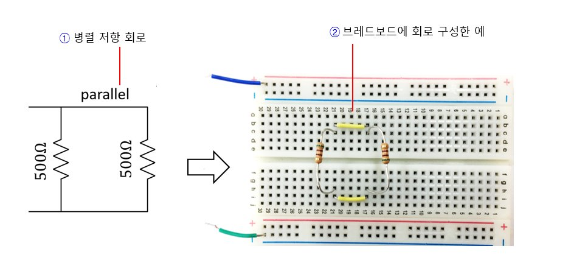

1. 그림과 같은 510Ω 2개를 병렬로 연결한 회로를 구성해본다. 510Ω이 없다면 가장 비슷한 값을 가지는 저항을 사용한다.
2. 브레드보드에 구성한 예이다. 아직 전원부를 연결하지는 않았다.

-----------------
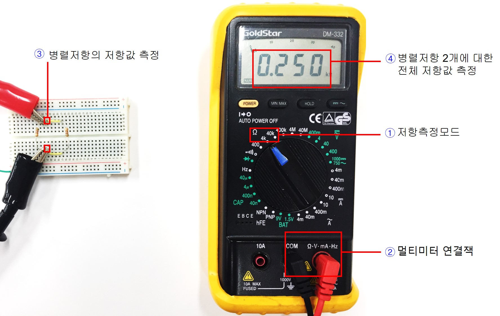

1. 멀티미터를 저항측정모드로 설정한다.
2. 멀티미터 측정 케이블을 본체에 연결한다.
3. 병렬회로의 양끝단에 그림과 같이 멀티미터 측정 클립을 연결한다. 
4. 멀티미터를 이용하여 측정한 저항값과 병렬저항에 대한 등가저항 계산식을 통해 얻은 값과 비교해본다. 저항 1개 대비 2개를 병렬 연결 할 경우 저항크기가 더 작아지는가?

--------------------------
### 병렬저항회로로 흐르는 전류 측정

병렬저항회로에서 전체로 흐르는 전류를 먼저 측정한다. 등가저항 교체한 뒤 흐르는 전류가 동일한지 비교해본다.

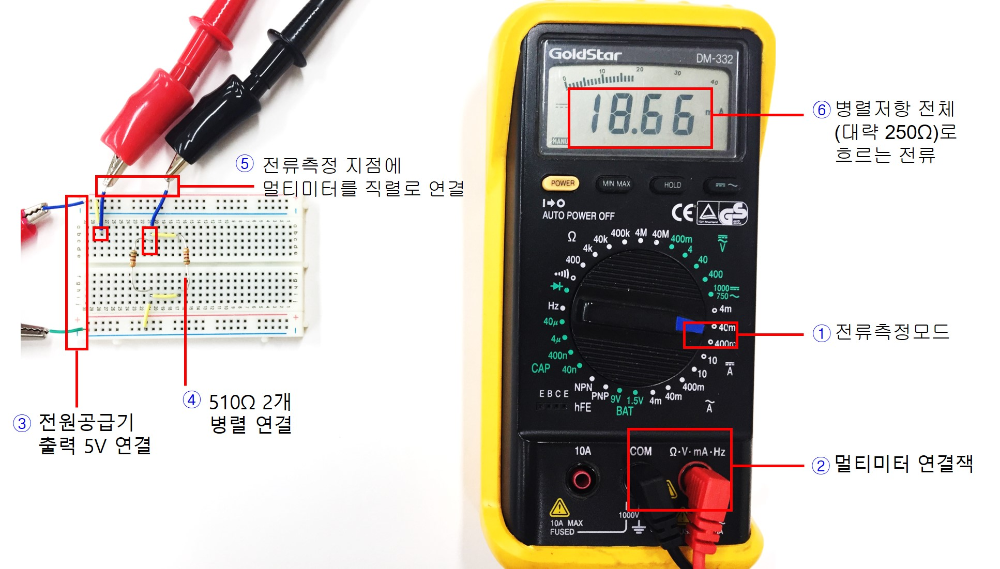

1. 멀티미터를 전류측정모드로 전환한다.
2. 멀티미터 측정케이블을 연결한다.
3. 전원공급기 출력 5V를 브레드보드에 연결한다. 
4. 저항 2개를 병렬로 구성한다.
5. 전원부에서 병렬저항 전체로 흐르는 전류를 측정하기 위해 표시된 위치에 점퍼선 2개를 이용하여 직렬로 멀티미티를 연결한다.
6. 입력전압과 측정전류로부터 병렬저항에 대한 전체 저항값을 계산해보자. 계산된 저항값을 가지는 저항으로 교체한 뒤 회로를 통해 흐르는 전류를 측정하여 기존 병렬저항회로에서 전체 전류와 일치하는지 비교해본다.

--------------------------------
### 병렬저항회로를 등가저항으로 교체한 뒤 전류 측정

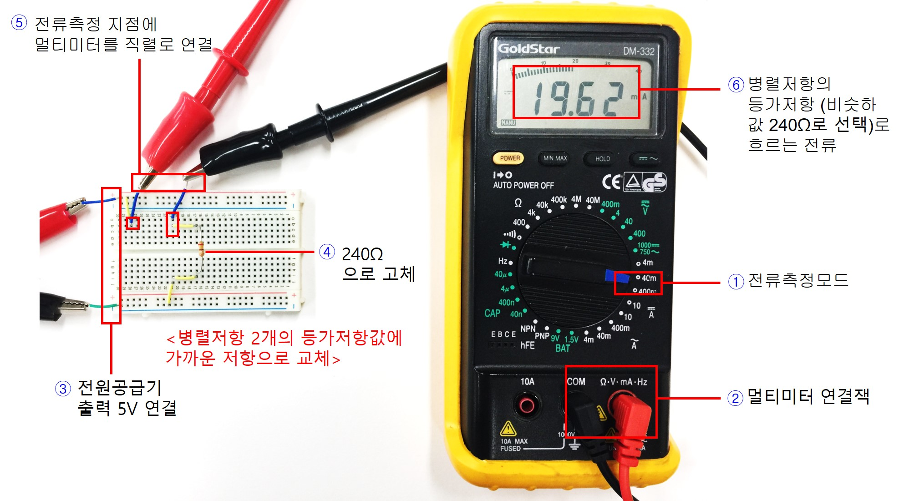

1. 멀티미터를 전류측정모드로 전환한다.
2. 멀티미터 측정케이블을 연결한다.
3. 전원공급기 출력 5V를 브레드보드에 연결한다. 
4. 병렬로 연결된 2개의 저항회로에 대해 입력전압, 전류를 측정하여 R=V/I식을 이용하여 등가저항값을 계산하고 가장 가까운 저항으로 병렬저항을 교체한다.
5. 그림과 같이 회로를 통해 흐르는 전류를 측정하기 위해 점퍼선 2개를 이용하여 직렬로 멀티미티를 연결한다.
6. 측정되는 전류가 등가저항으로 교체하기 전 병렬저항 2개 전체로 흐르는 전류와 일치하는지 비교해본다.

-----------------------------------
## 세부실험 3-5: 병렬저항회로에서 전류분배 법칙의 이해

본 실험에서는 병렬저항회로에서 각 저항크기에 따른 전류분배 원리를 실험으로 관찰한다.

### 고정저항과 가변저항을 이용한 병렬저항회로를 구성하고 저항측정

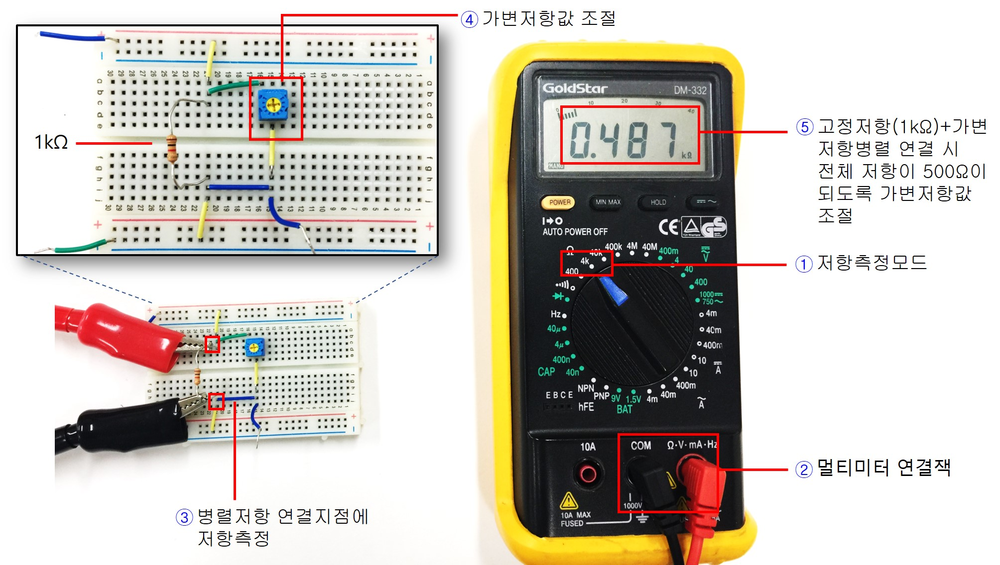

1. 브레드보드에 그림과 같이 고정저항 1kΩ과 가변저항을 병렬로 연결한 회로를 구성한다. 멀티미터를 저항측정모드로 설정한다.
2. 멀티미터 측정케이블을 연결한다.
3. 병렬로 연결된 저항회로의 전체 저항을 측정하기 위해 멀티미터 측정클립을 그림에 표시한 것과 같이 연결한다.
4. 가변저항값을 조절하여 1kΩ이 되도록 조절해보자. 이를 위해서 멀티미터 측정 LCD화면에 500Ω에 가까운 값이 될 때까지 가변저항 상단 나사를 조절하면 된다.
5. 고정저항 1kΩ과 가변저항 1kΩ로 연결되었을 경우 2개가 병렬저항회로로 구성되어 있으므로 전체 저항값을 멀티미터로 측정할 경우 500Ω으로 관찰될 것이다.

--------------------------------
### 병렬저항회로에서 각 저항으로 흐르는 전류를 측정하여 전류분배법칙 이해

현재 가변저항이 1kΩ로 설정되어 있으므로 병렬로 연결된 2개 저항으로 흐르는 각각의 전류는 크기가 같다. 가변저항값을 조절할 경우 각 저항으로 흐르는 전류의 변화를 관찰해보자.

1. 멀티미터를 전류측정모드로 전환한다.
2. 멀티미터 측정케이블을 본체에 연결한다.
3. 전원공급기 출력 5V를 브레드보드에 공급한다.
4. 이전 실험에서 가변저항을 1kΩ으로 설정한 상태임에 주의하자. 
5. 가변저항을 통해 흐르는 전류를 측정하기 위해 점퍼선 2개로 그림과 같이 측정지점을 분리하여 멀티미터 측정 클립을 연결한다.
6. 가변저항 1kΩ로 흐르는 전류를 관찰한다. 공급전압 5V와 저항값 1kΩ와의 관계를 생각해본다. 반대편 저항 1kΩ을 통해 흐르는 전류도 예측해본다. 두개의 전류가 같은가? 다르다면 현재 가변저항의 크기가 1kΩ이 아니므로 두 저항을 통해 흐르는 전류가 같아지도록 가변저항의 상단 다이얼을 조절하도록 한다.

--------------
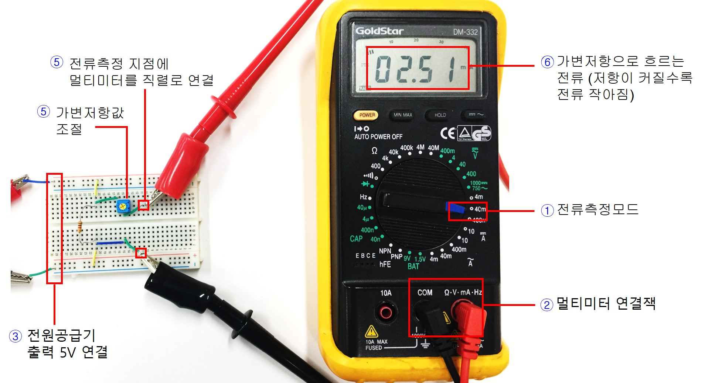

1. 멀티미터를 전류측정모드로 전환한다.
2. 멀티미터 측정케이블을 본체에 연결한다.
3. 전원공급기 출력 5V를 브레드보드에 공급한다.
4. 가변저항 상단 나사를 조절하여 저항값을 바꾸어본다. 이때 가변저항을 통해 흐르는 전류를 관찰하고자 한다. 
5. 가변저항을 통해 흐르는 전류를 측정하기 위해 점퍼선 2개로 측정지점을 분리하여 멀티미터를 직렬로 연결한다.
6. 가변저항으로 흐르는 전류를 관찰하면서 2.5mA가 될때까지 가변저항의 값을 조절한다. 이때 가변저항값을 멀티미터의 저항측정 모드를 이용하여 측정해본다. 현재 조절된 가변저항값이 1kΩ보다 더 커졌는가? 즉 병렬저항회로에서는 저항이 클수록 전류가 작아지는가? 병렬저항회로에서 각 저항으로 분배되는 전류의 크기에 대해 생각해본다.

