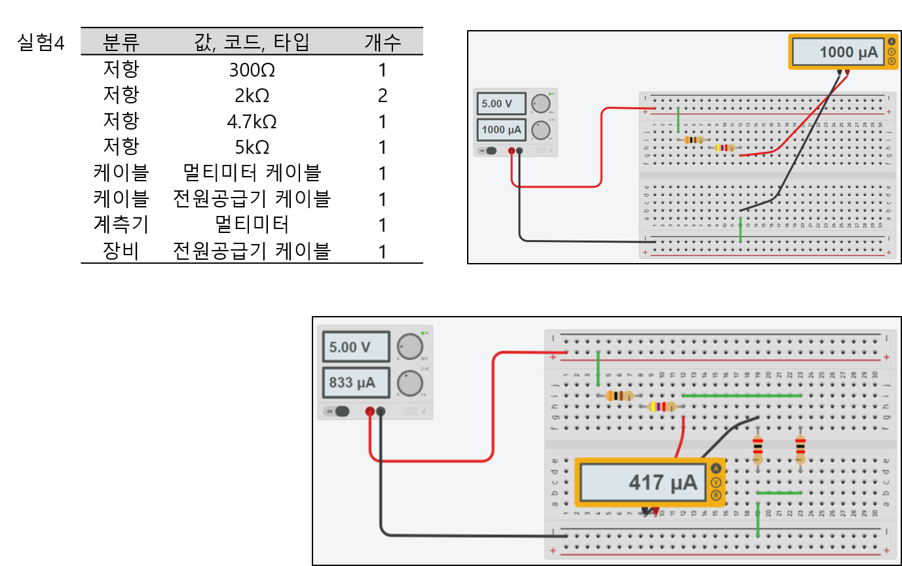
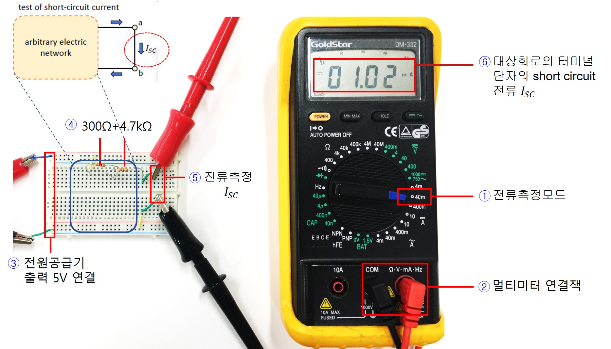
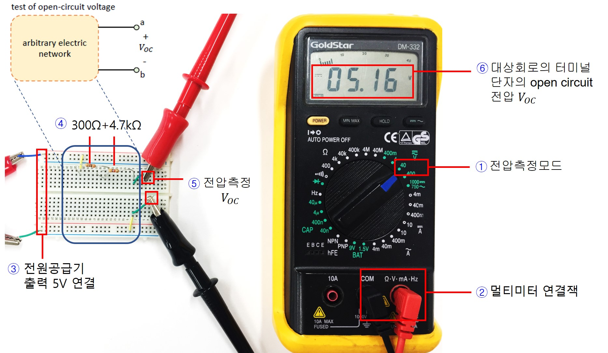
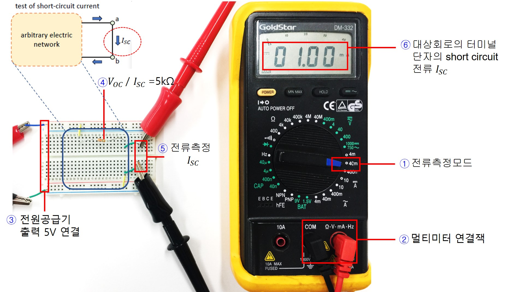
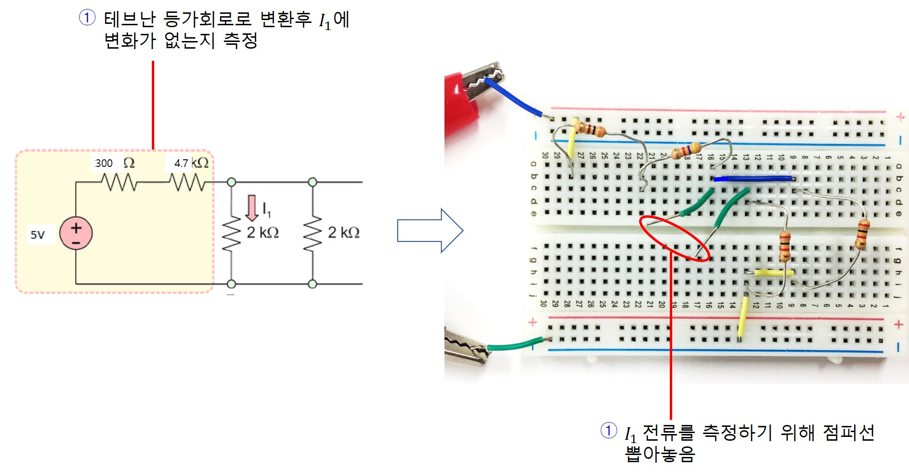
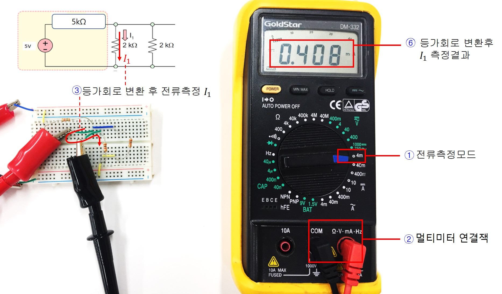

# 기초실험4: 테브난 등가회로

본 실험에서는 테브난 등가회로 변환원리를 실험을 통해 확인해본다.

## 실험목표
1. 등가회로로 변환하고자 하는 회로의 터미널 노드에서 Open Circuit 전압 및 Short Circuit 전류를 측정해본다.
2. 측정된 값으로부터 내부저항을 예측하고 전원과 내부저항의 직렬회로로 변환한 뒤 기존의 나머지 회로의 특성에 영향을 주지 않는지 실험으로 비교해본다.

-------------------------
이번 실험에 사용할 주요 부품과 이를 브레드보드에 구현한 주요 회로도는 다음과 같다.

------------------------
## 세부실험 4-1: Open Circuit 전압 및 Short Circuit 전류를 측정

본 실험에서는 등가회로로 변환 하고자 하는 회로의 터미널 단자에서 Open Circuit 전압 및 Short Circuit 전류를 측정해본다.

### Short Circuit 전류

1. 멀티미터를 전류측정모드로 전환한다.
2. 멀티미터 측정 케이블을 본체에 연결한다.
3. 전원공급기 출력 5V를 브레드보드에 공급한다.
4. 변환 대상이 되는 회로를 그림과 같이 구성한다. 그림의 예는 300Ω과 4.7kΩ이 직렬로 연결된 회로이다. 
5. 이 회로의 터미널 단자를 short시켰을때 흐르는 전류를 측정하기 위해서는 그림과 같이 터미널 단자에 직접 직렬로 멀티미터를 연결하면 된다. (멀티미터의 내부저항이 0이므로 short circuit 상태가되며 이를 통해 흐르는 전류를 측정)
6. 멀티미터 LCD화면에 변환 대상이 되는 회로의 터미널 단자에 대해 short circuit 전류가 측정되어 표시된다.

### Open Circuit 전압

1. 멀티미터를 전압측정모드로 전환한다.
2. 멀티미터 측정 케이블을 본체에 연결한다.
3. 전원공급기 출력 5V를 브레드보드에 공급한다.
4. 변환 대상이 되는 회로를 그림과 같이 구성한다. 그림의 예는 300Ω과 4.7kΩ이 직렬로 연결된 회로이다. 
5. 이 회로의 터미널 단자를 open시켰을 때 양단 전압을 측정하기 위해서는 그림과 같이 터미널 단자에 직접 병렬로 멀티미터를 연결하면 된다. (멀티미터의 내부저항이 무한대이므로 open circuit 전압 측정과 같다.)
6. 멀티미터 LCD화면에 터미널 단자에 대해 open circuit 전압이 측정되어 표시된다.

## 세부실험 4-2: 테브난 등가회로로 변환

세부실험 4-1에서 측정한 Open Circuit 전압 및 Short Circuit 전류값으로부터 내부저항, 전원을 결정한 뒤 등가회로를 재구성하고 변환 전후의 동작특성을 비교해본다.

1. 멀티미터를 전류측정모드로 전환한다.
2. 멀티미터 측정 케이블을 본체에 연결한다.
3. 전원공급기 출력 5V를 브레드보드에 공급한다.
4. 변환대상이 되는 회로의 터미널 단자에 대해 Open Circuit 전압 및 Short Circuit 전류값을 측정하고 R=V/I식을 통해 내부저항값을 계산한다. 계산된 저항값을 이용하여 등가회로를 브레브보드에 그림과 같이 구성한다.
5. 변환된회로의 터미널 단자를 short시켰을때 흐르는 전류를 측정하기 위해 그림과 같이 직렬로 멀티미터를 연결하면 된다. 
6. 멀티미터 LCD화면에 short circuit 전류가 표시된다. 등가회로로 변환하기 short circuit 전류와 동일한가 ?

## 세부실험 4-3: 등가회로 변환에 따른 나머지 회로의 영향

변환 대상이 되는 회로를 등가회로로 변환했다면 변환 전후로 기존의 나머지 회로의 특성에 영향을 주지 않아야 한다. 본 실험을 통해 테브난 등가회로로 변환한 후에 나머지 회로의 동작특성에 변화가 없음을 실험으로 관찰해본다.

1. 그림과 같은 회로를 먼저 구성하고 점선으로 표시된 부분을 테브난 등가회로로 변환한 뒤 나머지 회로로 흐르는 전류에 영향을 주지 않는지 관찰하고자 한다.
2. 브레드보드로 회로를 그림과 같이 구성하고 I1전류를 측정할 수 있도록 점퍼선 2개를 이용하여 뽑아둔다.

-------------------

1. 멀티미터를 전류측정모드로 전환한다.
2. 멀티미터 측정 케이블을 본체에 연결한다.
3. I1전류를 측정할 수 있도록 미리 뽑아둔 점퍼선에 그림과 같이 멀티미터를 직렬로 연결하여 전류를 측정해본다.
4. 멀티미터 LCD화면에 I1전류가 표시된다. 테브난 등가회로로 변환한 뒤에도 이 전류값이 동일해야 함을 염두해두자.

-------------------

1. 점선의 회로는 기존 회로를 테브난 등가회로로 변환한 결과이다. 변환전후로 나머지 회로의 동작특성에 영향을 주는지 비교하기 위해 전류값을 측정해보기로 한다. 이를 위해 멀티미터를 전류측정모드로 전환한다.
2. 멀티미터 측정 케이블을 본체에 연결한다.
3. I1 전류를 측정할 수 있도록 미리 뽑아놓은 점퍼선에 그림과 같이 멀티미터를 직렬로 연결하여 전류를 측정해본다. 등가회로로 제대로 변환했다면 이 값이 등가회로로 변환하기 전에 측정한 값과 동일해야 한다.
4. 멀티미터 LCD화면에 I1전류가 표시된다. 테브난 등가회로로 변환한 뒤에도 나머지 회로의 동작 특성이 동일해야 하며 본 실험에서는 I1 동일하게 측정되는지 비교해본다.

