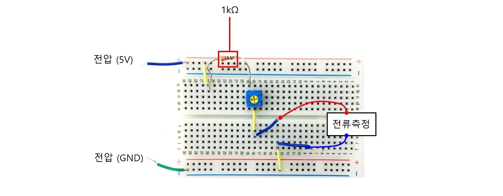
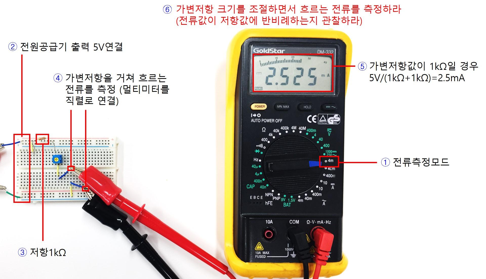

# 기초실험5: 최대전력전달조건

본 실험에서는 부하저항의 크기에 따른 전압강하와 전류의 상호관계를 실험으로 관찰하고 전압과 전류의 곱인 전력전달을 최대화하기 위한 조건을 탐색해본다.

# 실험목표
1. 부하저항에 소모되는 전압과 전류 및 전력에 대해 이해한다.
2. 부하저항의 크기에 비례하여 전압강하가 발생하지만 반대로 저항 증가로 인해 전류가 줄어드는 현상을 관찰한다.
3. 전력공급 회로의 내부 저항크기가 부하저항에 전달되는 전압과 전류에 영향을 주는 현상을 실험으로 파악한다.
4. 부하저항값을 바꾸어가며 전압과 전류의 곱이 가장 크게 되는 지점을 실험적으로 찾아보고 내부저항크기와의 연관성을 파악한다.

-------------------------
이번 실험에 사용할 주요 부품과 이를 브레드보드에 구현한 주요 회로도는 다음과 같다.

--------------------------
### 예비보고서

1. 본 실험 자료를 읽고 실험 목차, 절차, 예상 결과에 대해 요약해본다. 
2. 추가로 담당교수의 지시사항을 숙지하여 사전조사한 내용을 예비 리포트에 작성해 온다.

------------------------
## 세부실험 5-1: 부하저항에 전달되는 전압

본 실험에서는 내부저항과 직렬로 연결된 부하저항에 전달되는 전압의 크기를 측정해보고 부하저항의 크기와의 관계를 실험으로 관찰하자. 부하저항을 제외한 회로는 테브난 등가회로 변환 원리를 이용하여 내부전원과 내부저항으로 변환되었다고 가정한다.

### 내부저항과 부하저항으로 회로구성

내부저항 R1 크기 대비 부하저항 R2값의 상대적 크기에 따라 부하저항에 전압이 걸릴 것이다. 즉 부하저항에 큰 전압이 전달되기 위해서는 내부저항 R1보다 상대적으로 큰 저항을 부하저항으로 사용해야 할 것이다.

1. 그림과 같이 전원과 내부저항, 부하저항을 직렬로 연결한다. 이때 부하저항에는 가변저항(최대 10kΩ)을 사용한다. 가변저항값을 바꾸면서 부하에 전달되는 전압의 크기를 측정해본다.
2. 이를 위해 브레드보드에 그림과 같이 회로를 구성해본다. 내부저항으로 1kΩ을 사용한다. 
3. 가변저항 양단 전압을 측정할 수 있도록 그림과 같이 점퍼를 연결해둔다.

### 부하저항 크기에 따른 전압측정

부하저항을 조절하면서 전달되는 전압을 측정해본다.
부하에 전압을 크게 전달하기 위해서 부하저항 크기를 키우면 되는지 관찰한다.

1. 멀티미터를 전압측정모드로 전환한다.
2. 전원공급기 출력 5V를 브레드보드에 연결한다.
3. 내부저항으로 1kΩ을 사용한다.
4. 가변저항값을 조절하면서 저항 양단 전압을 측정해본다. 
5. 그림에서는 가변저항값이 1kΩ로 조정되었고 따라서 양단전압이 2.5V로 측정된 모습이다. 가변저항 크기에 비례하여 전압이 크게 측정되는가?

## 세부실험 5-2: 부하저항에 전달되는 전류

본 실험에서는 내부저항과 직렬로 연결된 부하저항에 전달되는 전류의 크기를 측정해보고 부하저항의 크기와의 관계를 생각해본다. 부하저항을 제외한 임의의 회로는 테브난 등가회로 변환 원리를 이용하여 내부전원과 내부저항으로 변환되었다고 가정한다.

### 전류측정위해 회로 변형

내부저항 R1과 부하저항 R2의 합이 회로 전체로 흐르는 전류를 결정한다. 부하저항에 전압을 많이 전달하기 위해서는 부하저항값을 크게하면 되지만 반대로 전체 전류량이 줄어들게 됨을 관찰한다.

1. 브레드보드에 그림과 같이 회로를 구성해본다. 내부저항으로 1kΩ을 사용하고 부하저항으로는 가변저항(최대 10kΩ)을 사용한다. 가변저항값을 조절하면서 전체회로로 흐르는 전류를 측정해본다.
2. 그림과 같이 저항을 통해 흐르는 전류를 측정할 수 있도록 점퍼를 미리 연결해둔다.

### 부하저항 크기에 따른 전류측정

부하저항의 크기를 조절하면서 부하저항으로 흐르는 전류를 측정해본다. 부하저항에 더 큰 전류를 전달하기 위해서는 부하저항의 크기를 줄여야 하지만 부하저항에 인가되는 전압이 줄어들게 된다. 따라서 전류와 전압의 곱을 극대화하기 위해서 부하저항의 크기를 어떻게 조절해야 하는지 생각해보고 실험을 통해 최적값을 찾아본다.

1. 멀티미터를 전류측정모드로 전환한다.
2. 전원공급기 출력 5V를 브레드보드에 연결한다.
3. 내부저항으로 1kΩ을 사용한다.
4. 부하저항 값을 조절하면서 저항을 통해 흐르는 전류를 측정해본다. 
5. 그림에서는 부하저항값이 1kΩ로 설정되어 전체 저항을 통해 흐르는 전류가 5V/2kΩ=2.5mA로 측정된다. 부하저항 크기와 전류 및 전압과의 관계에 대해 생각해보고 전압x전류 값이 극대화되기 위한 부하저항의 크기를 실험을 통해 찾아본다.

---------------------------
## 결과보고서

1. 담당교수의 지시사항을 숙지하여 해당 내용에 대한 실험을 실시한다. 실험과정, 측정데이타를 결과 보고서에 작성하여 제출한다.
2. 본 실험자료에서 제시된 기본적인 실험 과정, 장비사용방법, 측정 결과들을 충실히 요약 정리한다. 
3. 실험과 관련된 이론과 실측치를 비교하여 회로의 전기적 동작 원리에 대한 결론을 내려본다. (Optional) 
4. 내부저항과 로드저항의 크기를 일치시키지 못했다고 가정해보자. 만약 이러한 회로에서 이론적인 최대전력전달치 만큼 전력을 로드에 공급하기 위해서는 전원소스의 전압을 더욱 높이면 되는가? 가능한 이유에 대해서 생각해보고, 만약 단점이 있다면 그 내용에 대해서도 보고서에 작성한다. (Optional)

