# PSPICE를 활용한 회로 시뮬레이션: R-L 회로

PSPICE를 이용하여 회로를 구성하고 원하는 입력을 설정한 뒤 시뮬레이션을 통해 회로 동작 특성을 파형으로 관찰해본다. 

## R-L 회로의 시간에 따른 응답특성 (과도응답, Transient Analysis) 시뮬레이션 방법

R과 L의 직렬회로에 사각파를 인가한 뒤 인덕터 양단 전압의 시간에 따른 출력파형을 시뮬레이션으로 관찰해본다.

--------------------
### PSPICE 프로젝트 실행

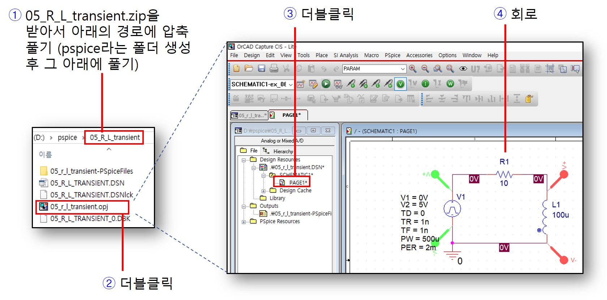

1. 05_R_L_transient.zip파일을 다운 받고 C나 D드라이브 아래 pspice라는 폴더를 만든 뒤 그 아래에서 압축을 해지한다. 압축파일이 풀리는 경로에 한글 이름이 포함되어 있으면 정상적인 실행이 되지 않으므로 주의한다.
2. 폴더안에 프로젝트 파일을 더블클릭한다.
3. 프로젝트 파일 목록에서 SCHEMETIC아래에 PAGE1을 더블클릭한다.
4. 준비된 회로가 열린다. 입력신호로 사각파가 인가되고, R와 L의 직렬회로로 구성되어 있음을 확인한다.

----------------------
### R-L 회로 구성 및 입력 신호 정의

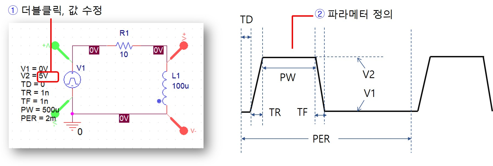

1. 입력파형의 속성 파라메터값을 더블클릭하면 원하는 값으로 변경이 가능하다.
2. 각 파라메터의 의미는 그림과 같다. 원하는 파형을 생성하기 위해 값을 적절히 설정한다.

----------------------
### PSPICE 시뮬레이션 셋업 및 설정

시뮬레이션을 진행하기 전에 먼저 시뮬레이션 조건을 설정해야 한다.

1. 상단메뉴에서 PSPICE를 클릭하고 Edit Simulation을 클릭한다.
2. Analysis Tab을 클릭한 뒤 Analysis Type에 Time Domain을 선택한다. (이미 선택되어 있으면 무시), General Settings를 클릭한다.
3. Simulation Time을 5ms로 설정한다. 더 긴시간 동작을 측정하기 위해 값을 늘리면 된다.
4. 다시 실행메뉴로 돌아가서 Run을 실행한다.

-----------------------
### 시뮬레이션 결과 파형

입력파형이 회로로 인가되어 시간에 따른 회로의 동작을 파형으로 확인할 수 있다. 

1. 초록색 파형이 입력전압의 시간에 따른 파형이고, 빨간색은 L1양단의 전압에 해당된다. 
2. 입력이 변하는 순간에 전류의 변화량이 생기고 이때만 인덕터 양단 전압 생성됨을 관찰해본다.
3. 시뮬레이션 설정에서 종료시간을 5ms로 설정하였다. 더 긴시간 파형을 관찰하고자 하면 이전으로 돌아가서 시뮬레이션 종료시간을 변경하면 된다.

------------------------
## Parameter Sweep에 따른 Transient Analysis 시뮬레이션 방법

회로의 특정 파라메터를 변경하면서 (Sweep) 시간에 따른 출력응답 (Transient Analysis)를 시뮬레이션으로 관찰해보자.

------------------------
### PSPICE 프로젝트 실행

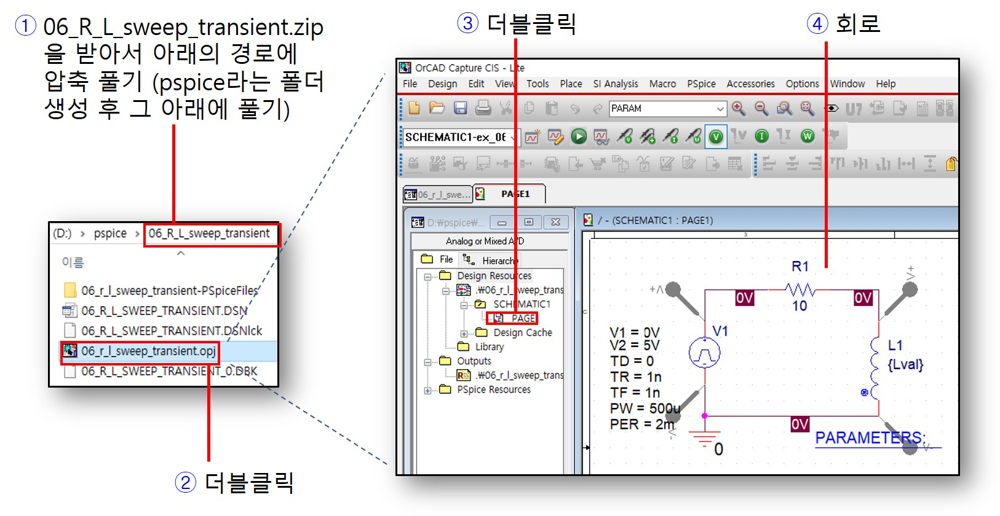

1. 06_R_L_sweep_transient.zip파일을 다운 받고 C나 D드라이브 아래 pspice라는 폴더를 만든 뒤 그 아래에서 압축을 해지한다. 압축파일이 풀리는 경로에 한글 이름이 포함되어 있으면 정상적인 실행이 되지 않으므로 주의한다.
2. 폴더안에 프로젝트 파일을 더블클릭한다.
3. 프로젝트 파일 목록에서 SCHEMETIC아래에 PAGE1을 더블클릭한다.
4. 준비된 회로가 열린다. 입력신호로 사각파가 인가되고, R와 L의 직렬회로로 구성되어 있음을 확인한다. 특히 L1의 인덕턴스 값이 상수가 아닌 변수로 설정되어 있음에 주의한다. 다음섹션에서 파라메터 값을 시뮬레이션 설정환경에서 지정할 수 있다.

------------------------
### R-L 회로 구성 및 입력 신호 정의

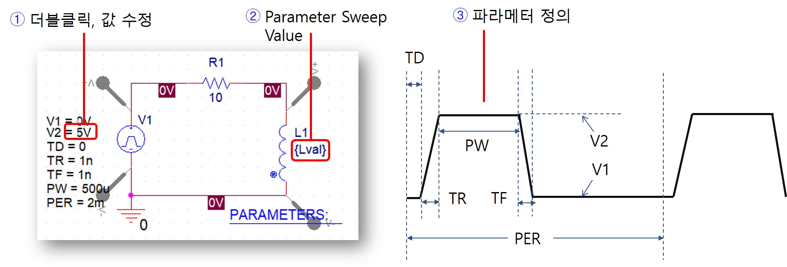

1. 입력파형의 속성 파라메터값을 더블클릭하면 원하는 값으로 변경이 가능하다.
2. 파라메터를 변경하면서 시뮬레이션을 반복 실행할 수 있도록 인덕턴스 값을 변수화 해두었음에 주의하자.
3. 각 파라메터의 의미는 그림과 같다. 원하는 파형을 생성하기 위해 값을 적절히 설정한다.

------------------------
### PSPICE 시뮬레이션 셋업 및 설정

시뮬레이션을 진행하기 전에 먼저 시뮬레이션 조건을 설정해야 한다.

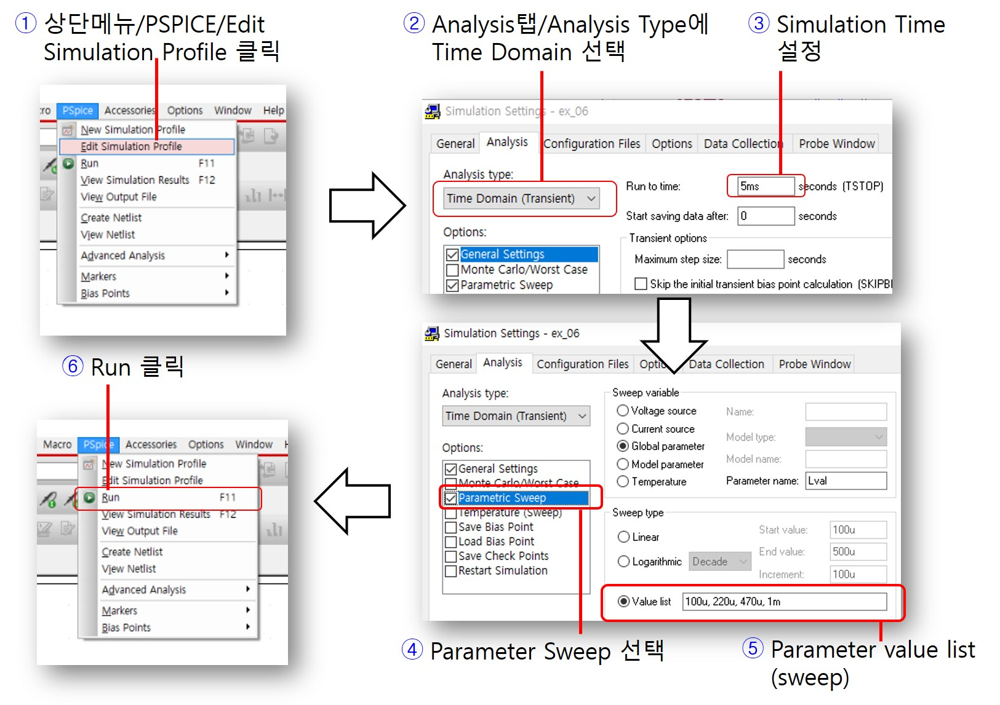

1. 상단메뉴에서 PSPICE를 클릭하고 Edit Simulation을 클릭한다.
2. Analysis Tab을 클릭한 뒤 Analysis Type에 Time Domain을 선택한다. (이미 선택되어 있으면 무시), General Settings를 클릭한다.
3. Simulation Time을 5ms로 설정한다. 더 긴시간 동작을 측정하기 위해 값을 늘리면 된다.
4. Parameter Sweep을 채크한다.
5. Global Parameter에 값을 Lval로 지정하고, Sweep Type에 Value list에 값 4개를 지정한다. 
6. 다시 실행메뉴로 돌아가서 Run을 실행한다.

------------------------
### 시뮬레이션 결과 파형

인덕터 값을 변경하면서 과도응답 시뮬레이션을 반복수행한 결과 파형을 볼 수 있다.

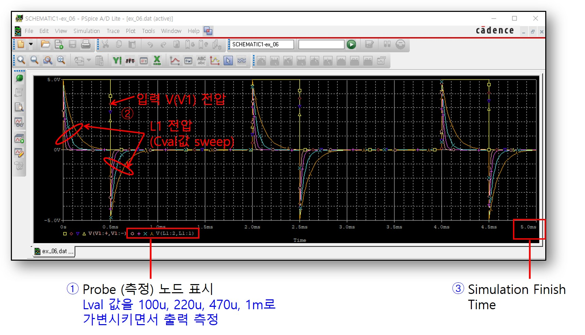

1. 가로축으로 시간에 따른 출력파형을 보여준다. 파라메터 Sweep을 4번 수행하였으므로 4개의 파형에 대해서 기호로 구분하여 표시된다.
2. 입력전압과 인덕터 L1의 전압을 보여준다. 특히 Lval로 지정한 파라매터를 4회 변경하여 회로 동작에 대한 시뮬레이션 결과를 보여주었다. 인덕턴스 값이 커질수록 입력전압의 변화에 의한 전류 변화량이 발생될 때 전압 유도가 더욱 커지는 현상을 관찰할 수 있다.
3. 시뮬레이션 종료시간을 5ms로 설정하였으며 시뮬레이션 설정환경에서 변경 가능하다.

------------------------
## 입력전원을 Sine으로 변경 후 Transient Analysis 시뮬레이션

입력전원을 사각파에서 사인파로 변경한 뒤 과도응답 특성을 보고자 한다.

------------------------
### PSPICE 프로젝트 실행

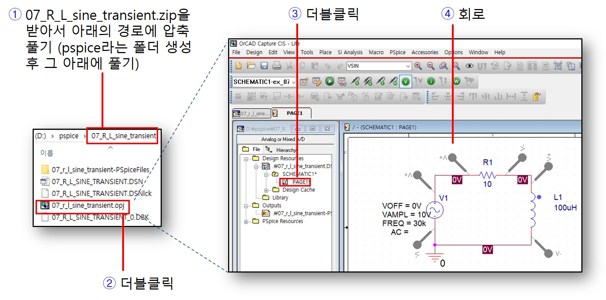

1. 07_R_L_sine_transient.zip파일을 다운 받고 C나 D드라이브 아래 pspice라는 폴더를 만든 뒤 그 아래에서 압축을 해지한다. 압축파일이 풀리는 경로에 한글 이름이 포함되어 있으면 정상적인 실행이 되지 않으므로 주의한다.
2. 폴더안에 프로젝트 파일을 더블클릭한다.
3. 프로젝트 파일 목록에서 SCHEMETIC아래에 PAGE1을 더블클릭한다.
4. 준비된 회로가 열린다. 기존의 사각파 입력전원이 삭제되고 사인파 입력전원으로 교체되었음에 주의하자. R와 L의 직렬회로로 구성되어 있음을 확인한다.  

------------------------
### R-L 회로 구성 및 입력 신호 정의

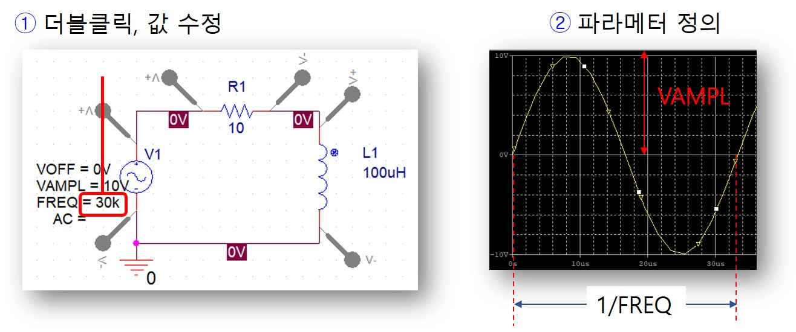

1. 입력파형의 속성 파라메터값을 더블클릭하면 원하는 값으로 변경이 가능하다. 사인파 입력의 진폭과 주파수를 설정할 수 있다.
2. 각 파라메터의 의미는 그림과 같다. 원하는 파형을 생성하기 위해 값을 적절히 설정한다.

------------------------
### PSPICE 시뮬레이션 셋업 및 설정

시뮬레이션을 진행하기 전에 먼저 시뮬레이션 조건을 설정해야 한다.

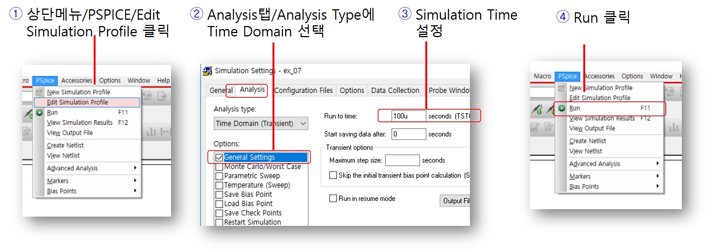

1. 상단메뉴에서 PSPICE를 클릭하고 Edit Simulation을 클릭한다.
2. Analysis Tab을 클릭한 뒤 Analysis Type에 Time Domain을 선택한다. (이미 선택되어 있으면 무시), General Settings를 클릭한다.
3. Simulation Time을 100us로 설정한다. 더 긴시간 동작을 측정하기 위해 값을 늘리면 된다.
4. 다시 실행메뉴로 돌아가서 Run을 실행한다.

------------------------
### 시뮬레이션 결과 파형

R, L 직렬회로에 대해 사인파를 입력으로 인가한 뒤 회로의 과도응답 특성을 시뮬레이션을 통해 관찰해보자.

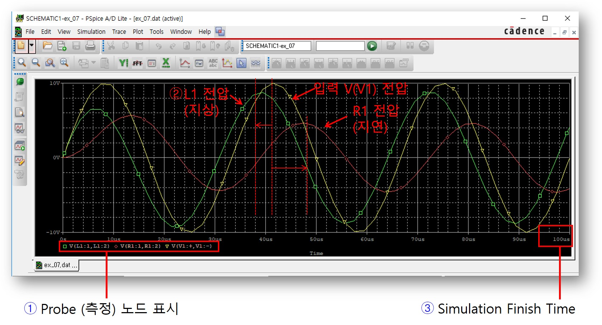

1. 가로축으로 시간에 따른 출력파형을 보여준다. 
2. 노란색은 입력전원신호이고 초록색은 인덕터 양단 전압을 보여준다. 인덕터 전압이 입력 신호 대비 지상되며 진폭도 감쇄되는지 관찰한다. 반대로 전류는 지연되어 저항양단의 전압이 지연되는 현상을 관찰할 수 있다.
3. 시뮬레이션 종료시간을 100us로 설정하였다. 시뮬레이션 종료시간을 조정하여 더 오랜시간동안 출력 파형을 관찰할 수 있다. 

------------------------
## 입력신호의 주파수 변화(AC Sweep)에 따른 회로 응답 특성 시뮬레이션 

입력신호의 주파수값을 가변하면서 회로의 출력응답 (AC Sweep, AC simulation)을 수행해보자.

------------------------
### PSPICE 프로젝트 실행

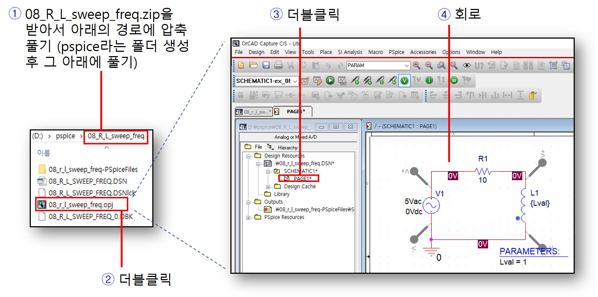

1. 08_R_L_swwep_freq.zip파일을 다운 받고 C나 D드라이브 아래 pspice라는 폴더를 만든 뒤 그 아래에서 압축을 해지한다. 압축파일이 풀리는 경로에 한글 이름이 포함되어 있으면 정상적인 실행이 되지 않으므로 주의한다.
2. 폴더안에 프로젝트 파일을 더블클릭한다.
3. 프로젝트 파일 목록에서 SCHEMETIC아래에 PAGE1을 더블클릭한다.
4. 준비된 회로가 열린다. 입력전원으로 Vac가 사용되었으며 R와 L의 직렬회로로 구성되어 있음을 확인한다. 

------------------------
### PSPICE 시뮬레이션 셋업 및 설정

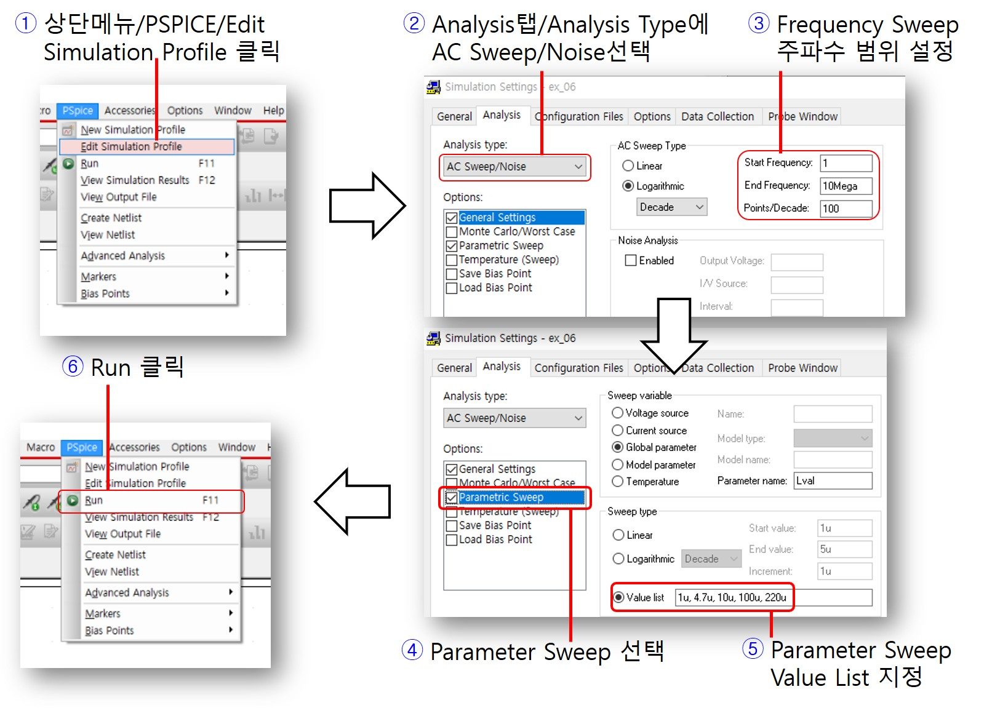

1. 상단메뉴에서 PSPICE를 클릭하고 Edit Simulation을 클릭한다.
2. Analysis Tab을 클릭한 뒤 Analysis Type에 AC Sweep/Noise을 선택한다. (이미 선택되어 있으면 무시), General Settings를 클릭한다.
3. 입력주파수를 가변시키며서 출력응답을 보는 시뮬레이션이므로 시간이 아닌 주파수 시작, 끝, 증가분을 설정한다.
4. Parameter Sweep을 채크한다.
5. Global Parameter에 값을 Lval로 지정하고, Sweep Type값에 value list 5개 값을 지정한다. 
6. 다시 실행메뉴로 돌아가서 Run을 실행한다.

------------------------
### 시뮬레이션 결과 파형

입력신호의 주파수를 가변하면서 출력 특성을 해석하기 위한 AC Sweep 시뮬레이션 결과 파형을 보도록 하자.

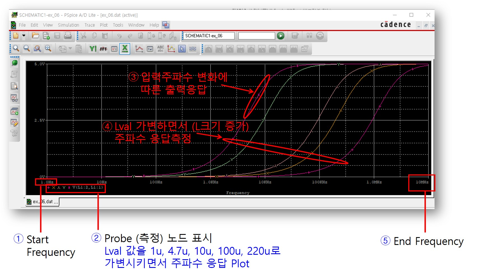

1. 주파수 변화에 따른 출력을 측정하는 시뮬레이션이므로 가로축이 주파수이다. 1Hz부터 10MHz까지 설정하였다. 
2. 입력 주파수 변화에 따라 관찰하고자 하는 전압 측정지점을 표시한다. 여기서는 인덕터 양단전압을 Probe한다. 주파수 Sweep과 동시에 인덕터 파라매터 Sweep을 동시에 수행한 결과를 표시한다.
3. AC Sweep 시뮬레이션 결과의 그래프는 주파수를 가변하면서 인덕터 전압을 Plot한 점들을 연속적으로 이어서 표시된 그림이다. 주파수가 증가함에 따라 인덕터 양단 전압의 감쇄가 줄어들고 있음을 관찰한다.
4. 인덕터 용량 값인 Lval값을 1u, 4.7u, 10u, 100u, 220u로 가변시키면서 주파수 응답 특성을 동시에 보여준다. 인덕터 값이 증가하면 같은 주파수에 대해 더 큰 출력응답크기를 보여주는 것을 관찰하자.

